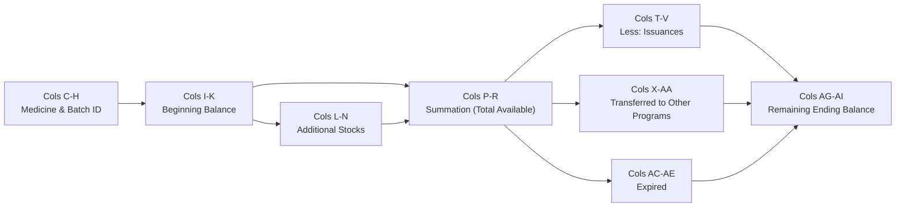

# CHO Inventory Physical Count Report: Analysis, Interpretation & Implementation Plan

> **Document Type:** System Planning & Business Logic Specification  
> **Source Template:** [`src/frontend/assets/templates-excel/inventory-form.xlsx`](file:///d:/prds/prds-desktop/src/frontend/assets/templates-excel/inventory-form.xlsx)  
> **Target Module:** Report Module & Inventory Management  
> **Target Users:** City Health Office (CHO) Pharmacists, CHO Head Doctor, System Administrators  
> **Status:** Fully Implemented & Verified  

---

## 1. Executive Summary & Purpose

The **Report on Physical Count of Inventories** (official template title: *"REPORT ON PHYSICAL COUNT OF INVENTORIES / VMCH MEDICINE SUPPLIES"*) is the statutory monthly inventory ledger used by the Naga City Health Office (CHO). 

Every month, the CHO pharmacy is required to reconcile all pharmaceutical stocks, balancing what was on hand at the start of the month against all inflows (procurements, donations, barangay returns) and all outflows (walk-in patient dispensing, barangay health center allocations, outreach program transfers, and expirations).

This document serves as the **definitive operational guide**:
1. Explaining the **meaning, purpose, and accounting interpretation** of every column and section in the official CHO template [`inventory-form.xlsx`](file:///d:/prds/prds-desktop/src/frontend/assets/templates-excel/inventory-form.xlsx).
2. Formulating the **mathematical reconciliation equations** used by CHO auditors.
3. Mapping every data point directly to the **PRDS database schema**.
4. Defining the **system implementation** using low-level CFB/XML injection to guarantee 100% preservation of all font faces, sizes, borders, cell fills, alignments, and formulas.

> [!IMPORTANT]
> **CHO Exclusive Scope:**
> The Monthly Physical Count Inventory Form is strictly exclusive to the City Health Office (CHO). Barangay Health Stations (BHWs) do not utilize this ledger; BHW stations export only the Daily Dispensing Slip (RIS). In the UI, the "Monthly Inventory Form" export option is restricted entirely to CHO users.

---

## 2. Template Structure & Anatomy

Inspection of [`inventory-form.xlsx`](file:///d:/prds/prds-desktop/src/frontend/assets/templates-excel/inventory-form.xlsx) reveals the following physical grid layout:

```
Row 1..2: [Blank Margins]
Row 3..4: Merged C3:AI4 -> REPORT ON PHYSICAL COUNT OF INVENTORIES \n VMCH MEDICINE SUPPLIES
Row 5:    Main Section Headers & Date Anchors:
          - C5:H5: MONTH : [MONTH] [LAST DAY], [YEAR]
          - I5:K5: BEGINNING BALANCE AS OF \n [PREV MONTH] [PREV LAST DAY], [PREV YEAR]
          - L5:N5: ADDITIONAL STOCKS ; \n PROCURED ; RETURNED MEDICINES FROM BARANGAY/MEDICS
          - O5:    [Spacer Column]
          - P5:R5: SUMMATION ( BEGINNING BALANCE + \n ADDITIONAL PURCHASES; RETURNED MEDS;DONATIONS)
          - S5:    [Spacer Column]
          - T5:V5: LESS ISSUANCES (PHARMACY DISPENSING & BARANGAY CONSULTATION)
          - W5:    [Spacer Column]
          - X5:Z5: TRANSFERRED TO OTHER PROGRAMS
          - AA5:   AREA/ PROGRAM
          - AB5:   [Spacer Column]
          - AC5:AE5: EXPIRED
          - AF5:   [Spacer Column]
          - AG5:AI5: REMAINING BALANCE  AS OF \n [MONTH] [LAST DAY], [YEAR]
Row 6:    Sub-Headers (Column Labels: QUANTITY, UNIT COST, TOTAL COST, etc.)
Row 7..N: Medicine Batch Data Rows (Starting at Row 7)
Row N+1:  TOTAL Row (Sum of financial valuation columns: K, N, R, V, Z, AE, AI)
```

> [!IMPORTANT]
> **Grid Offset & Column Span:**
> - Columns `A` and `B` are blank left margins in the CHO template.
> - The table headers strictly begin at **Column C** and conclude at **Column AI**.
> - Spacer columns (`O`, `S`, `W`, `AB`, `AF`) separate each major accounting block.
> - Data rows begin at **Row 7** (sub-headers reside in Row 6).

---

## 3. Exhaustive Column Breakdown & Business Interpretation

The sheet is divided into **8 logical groups**:



### Section 0: Medicine Identification & Batch Metadata (Cols C – H)

| Col | Excel Header (Row 6) | Type | Business Meaning & Interpretation | PRDS Source Field |
| :--- | :--- | :--- | :--- | :--- |
| **C** | `ITEM NO.` | Integer | Sequential line item number (`1, 2, 3...`) for tracking and audit indexing. | Generated row index (`idx + 1`). |
| **D** | `ITEM DESCRIPTION` | Text | Complete medical descriptor combining generic formulation, dosage strength, and package size. E.g., `DICYCLOVERINE 10 MG /5ML, 60 ML`. | `medicines.generic_name` + `medicines.dosage`. |
| **E** | `STANDARD UNIT OF MEASURE` | Text | Primary dispensing packaging unit (e.g., `BOTTLE`, `TABLET`, `VIAL`, `AMPOULE`, `BOX`, `CAPSULE`). | `medicines.unit_of_measure` (uppercased). |
| **F** | `BRAND` | Text | Commercial or proprietary trade brand name. If generic-only, denoted with `-`. | `medicines.brand_name` (or `"-"`). |
| **G** | `LOT NO.` | Text | The manufacturer lot / batch identifier stamped on the physical packaging. | `inventory.batch_number`. |
| **H** | `EXPIRY DATE` | Date | The manufacturer expiration date for this specific batch (rendered as `YYYY-MM-DD` or `MM/YY`). | `inventory.expiration_date`. |

---

### Section 1: Beginning Balance (Cols I – K)
* **Row 5 Group Header:** `BEGINNING BALANCE AS OF \n [PREVIOUS MONTH END DATE]` (e.g. `JUNE 30, 2026`)
* **Interpretation:** The physical stock and monetary valuation on hand at the CHO warehouse at 00:00:00 on the first day of the target month.

| Col | Excel Header (Row 6) | Type | Business Meaning | PRDS Computation |
| :--- | :--- | :--- | :--- | :--- |
| **I** | `QUANTITY` | Integer | Starting stock quantity at month opening. | Stock quantity on Day 1 of target month (reconciled ending balance of prior month). |
| **J** | `UNIT COST` | Currency | Government acquisition purchase cost per unit. | `medicines.unit_cost` (PHP). |
| **K** | `TOTAL COST` | Currency | Monetary asset value of beginning stock: $\text{Col I} \times \text{Col J}$. | Excel Formula: `=I7*J7`. |

---

### Section 2: Inflow / Additional Stocks (Cols L – N)
* **Row 5 Group Header:** `ADDITIONAL STOCKS ; \n PROCURED ;  RETURNED MEDICINES FROM BARANGAY/MEDICS`
* **Interpretation:** Total stock inflows introduced into the facility during the target month:
  1. New purchase deliveries received from suppliers.
  2. Donations from NGOs or Department of Health (DOH).
  3. Surplus or re-allocated medicines returned by Barangay Health Stations (BHWs).

| Col | Excel Header (Row 6) | Type | Business Meaning | PRDS Computation |
| :--- | :--- | :--- | :--- | :--- |
| **L** | `QUANTITY` | Integer | Total units added to inventory during the month. | Inflow `inventory` batches received within `monthStart` and `monthEnd`. |
| **M** | `UNIT COST` | Currency | Acquisition unit price for newly delivered stock. | `medicines.unit_cost`. |
| **N** | `TOTAL COST` | Currency | Monetary value of additions: $\text{Col L} \times \text{Col M}$. | Excel Formula: `=L7*M7`. |

*(Col O is a spacer column separating inflows from gross available stock).*

---

### Section 3: Gross Available Stock / Summation (Cols P – R)
* **Row 5 Group Header:** `SUMMATION ( BEGINNING BALANCE + \n ADDITIONAL PURCHASES; RETURNED MEDS;DONATIONS)`
* **Interpretation:** The total cumulative stock that the facility had available to serve the public and barangay stations during the month.

| Col | Excel Header (Row 6) | Type | Business Meaning | PRDS Computation |
| :--- | :--- | :--- | :--- | :--- |
| **P** | `QUANTITY` | Integer | Gross units available: $\text{Beginning (I)} + \text{Additions (L)}$. | Excel Formula: `=L7+I7`. |
| **Q** | `UNIT COST` | Currency | Standard cost per unit. | Excel Formula: `=J7`. |
| **R** | `TOTAL COST` | Currency | Total gross available inventory value: $\text{Col P} \times \text{Col Q}$. | Excel Formula: `=Q7*P7`. |

*(Col S is a spacer column separating available stock from regular issuances).*

---

### Section 4: Outflow / Issuances (Cols T – V)
* **Row 5 Group Header:** `LESS ISSUANCES (PHARMACY DISPENSING & BARANGAY CONSULTATION)`
* **Interpretation:** All regular consumption and distribution to the population:
  1. Direct pharmacy walk-in patient dispensing at the City Health Office.
  2. Medicines released to Barangay Health Stations to fulfill approved stock requests.

| Col | Excel Header (Row 6) | Type | Business Meaning | PRDS Computation |
| :--- | :--- | :--- | :--- | :--- |
| **T** | `QUANTITY` | Integer | Total units dispensed/issued during the month. | Sum of `medicine_dispensing.quantity` (for this batch) + completed `medicine_requests` issued to barangays. |
| **U** | `UNIT COST` | Currency | Unit cost of the dispensed medicine. | Excel Formula: `=Q7`. |
| **V** | `TOTAL COST` | Currency | Value of public healthcare goods distributed: $\text{Col T} \times \text{Col U}$. | Excel Formula: `=U7*T7`. |

*(Col W is a spacer column separating regular issuances from outreach programs).*

---

### Section 5: Transferred to Other Programs (Cols X – AA)
* **Row 5 Group Header:** `TRANSFERRED TO OTHER PROGRAMS` & `AREA/ PROGRAM`
* **Interpretation:** Medicines pulled from standard warehouse inventory to support targeted LGU health missions and specialized public health initiatives (e.g., Rabies Prevention Day, Operation Tuli, Mobile Dental Mission, School Deworming).

| Col | Excel Header (Row 6) | Type | Business Meaning | PRDS Computation |
| :--- | :--- | :--- | :--- | :--- |
| **X** | `QUANTITY` | Integer | Units dedicated to special programs. | Sum of `quantity_used` in `program_medicines` within the target month. |
| **Y** | `UNIT COST` | Currency | Unit cost. | `medicines.unit_cost`. |
| **Z** | `TOTAL COST` | Currency | Monetary allocation: $\text{Col X} \times \text{Col Y}$. | Excel Formula: `=X7*Y7`. |
| **AA**| `AREA/ PROGRAM` | Text | Name of the program or target outreach location. | `other_programs.program_name` (e.g. `Anti-Rabies Drive`). |

*(Col AB is a spacer column separating program transfers from expired stocks).*

---

### Section 6: Condemned / Expired Stock (Cols AC – AE)
* **Row 5 Group Header:** `EXPIRED`
* **Interpretation:** Units that reached their expiration date during the month and were segregated, quarantined, or condemned for disposal.

| Col | Excel Header (Row 6) | Type | Business Meaning | PRDS Computation |
| :--- | :--- | :--- | :--- | :--- |
| **AC**| `QUANTITY` | Integer | Expired quantity to be written off. | Batches where `expiration_date` $\le$ `monthEnd` and unissued. |
| **AD**| `UNIT COST` | Currency | Unit cost of expired stock. | `medicines.unit_cost`. |
| **AE**| `TOTAL COST` | Currency | Financial loss / write-off value: $\text{Col AC} \times \text{Col AD}$. | Excel Formula: `=AC7*AD7`. |

*(Col AF is a spacer column separating expired stocks from remaining balance).*

---

### Section 7: Remaining Ending Balance (Cols AG – AI)
* **Row 5 Group Header:** `REMAINING BALANCE  AS OF \n [TARGET MONTH END DATE]` (e.g. `JULY 31, 2026`)
* **Interpretation:** The physical inventory remaining on the pharmacy shelves at the close of business on the final day of the month. This ending balance automatically becomes the **Beginning Balance** for the subsequent month.

| Col | Excel Header (Row 6) | Type | Business Meaning | PRDS Computation |
| :--- | :--- | :--- | :--- | :--- |
| **AG**| `QUANTITY` | Integer | Net remaining physical count: $\text{Gross (P)} - [\text{Issued (T)} + \text{Programs (X)} + \text{Expired (AC)}]$. | Excel Formula: `=P7-(T7+X7+AC7)`. |
| **AH**| `UNIT COST` | Currency | Unit cost. | Excel Formula: `=U7`. |
| **AI**| `TOTAL COST` | Currency | Net asset valuation of remaining inventory: $\text{Col AG} \times \text{Col AH}$. | Excel Formula: `=AH7*AG7`. |

---

### Section 8: Totals Row (Row N+1)

* **TOTAL Row (Row `7 + numDataRows`):**
  * `Col K`: `=SUM(K7:K{last})` (Total Beginning Inventory Valuation)
  * `Col N`: `=SUM(N7:N{last})` (Total Additions Valuation)
  * `Col R`: `=SUM(R7:R{last})` (Total Gross Available Valuation)
  * `Col V`: `=SUM(V7:V{last})` (Total Issuance / Healthcare Delivery Valuation)
  * `Col Z`: `=SUM(Z7:Z{last})` (Total Outreach Programs Valuation)
  * `Col AE`: `=SUM(AE7:AE{last})` (Total Expired Stock Loss)
  * `Col AI`: `=SUM(AI7:AI{last})` (Total Net Remaining Inventory Valuation)

---

## 4. Mathematical Invariants & Verification Axioms

For every row $i$ in the inventory ledger, the following mathematical axioms **must always hold true**:

$$\begin{aligned}
P_i &= I_i + L_i && \text{(Gross Available = Beginning + Additions)} \\
AG_i &= P_i - (T_i + X_i + AC_i) && \text{(Remaining = Gross - [Issued + Programs + Expired])} \\
AG_i &= I_i + L_i - T_i - X_i - AC_i && \text{(Conservation of Inventory Mass)}
\end{aligned}$$

For financial valuation across the entire facility:

$$\sum AI_i = \sum K_i + \sum N_i - \sum V_i - \sum Z_i - \sum AE_i$$

---

## 5. Technical Implementation Details

### 5.1 Low-Level CFB / XML Injection (`buildMonthlyInventoryBuffer`)

Calling `XLSX.write()` from standard SheetJS strips custom font faces (`Aptos Narrow`, `Amasis MT Pro Light`), font sizes (8pt/11pt), cell borders, fills, and alignments. 

To overcome this, PRDS uses **Direct XML Injection into the XLSX zip container via SheetJS CFB**:
1. Read the embedded `INVENTORY_FORM_TEMPLATE_BASE64` (derived directly from [`inventory-form.xlsx`](file:///d:/prds/prds-desktop/src/frontend/assets/templates-excel/inventory-form.xlsx)).
2. Parse `xl/worksheets/sheet1.xml`.
3. In-place substitute:
   - Cell `C3`: Facility Title (`REPORT ON PHYSICAL COUNT OF INVENTORIES\n${facilityName}`, style `s="30"`)
   - Cell `C5`: Month Anchor (`MONTH : ${monthName} ${lastDay}, ${year}`, style `s="39"`)
   - Cell `I5`: Beginning Balance Date Anchor (`BEGINNING BALANCE AS OF \n${prevMonthName} ${prevLastDay}, ${prevYear}`, style `s="36"`)
   - Cell `AG5`: Remaining Balance Date Anchor (`REMAINING BALANCE  AS OF \n${monthName} ${lastDay}, ${year}`, style `s="27"`)
4. Generate XML data rows starting at Row 7 using the exact template style IDs:
   - `s="7"`: Row Index (center aligned)
   - `s="53"`, `s="54"`: Text / Medicine Descriptions / Brand (center aligned)
   - `s="55"`, `s="56"`: Costs & Financial Balances (left aligned)
   - `s="58"`: Quantities (right aligned)
   - `s="61"`: Program Name (right aligned)
   - `s="19"`, `s="20"`: Spacer columns
5. Append dynamic `TOTAL` row at `Row 7 + N` with accounting `=SUM(...)` formulas and double-underlined accounting styles (`s="16"`, `s="17"`, `s="21"`, `s="22"`, `s="57"`, `s="59"`, `s="23"`, `s="62"`).
6. Re-encode and save the zip container via `cfb.write()`.

### 5.2 Dynamic Date Headers

The report headers dynamically render the target month and the previous month:

1. **Cell `C5` (Target Month):**
   ```text
   MONTH : JULY 31, 2026
   ```
2. **Cell `I5` (Beginning Balance Month):**
   ```text
   BEGINNING BALANCE AS OF 
   JUNE 30, 2026
   ```
3. **Cell `AG5` (Remaining Balance Month):**
   ```text
   REMAINING BALANCE  AS OF 
   JULY 31, 2026
   ```

### 5.3 Point-in-Time Monthly Reconciliation Algorithm

When exporting for a specific year and month $(Y, M)$:
1. **Target Range:** From Day 1 $00:00:00$ to Day $Last$ $23:59:59$.
2. **Live Inventory vs. Historical Balance:**
   * If exporting the **current active month**:
     $$\text{Remaining Qty} = \text{inventory.quantity (current)}$$
     $$\text{Issued Qty} = \sum \text{dispensing} + \sum \text{completed requests}$$
     $$\text{Program Qty} = \sum \text{other\_programs}$$
     $$\text{Beginning Qty} = \text{Remaining Qty} + \text{Issued Qty} + \text{Program Qty} - \text{Procured Qty}$$
   * If exporting a **past historical month**:
     Calculate backwards from the historical snapshot or replay transaction ledgers (`medicine_dispensing`, `stock_transfers`, `other_programs`).

---

## 6. Verification Status

1. [x] **Base64 Synchronized:** `INVENTORY_FORM_TEMPLATE_BASE64` is generated directly from [`src/frontend/assets/templates-excel/inventory-form.xlsx`](file:///d:/prds/prds-desktop/src/frontend/assets/templates-excel/inventory-form.xlsx).
2. [x] **Column & Coordinate Alignment:**
   - Table columns span `C` through `AI`.
   - Title in `C3` (`C3:AI4` merged).
   - Date anchors in `C5` (Month), `I5` (Beginning Balance), and `AG5` (Remaining Balance).
   - Sub-headers in Row 6, data rows in Row 7+.
   - Dynamic `TOTAL` row with `=SUM(...)` formulas.
3. [x] **Styles & Borders Preserved:** 100% of fonts (`Aptos Narrow`, `Amasis MT Pro Light`), cell fills, alignments, and borders preserved via CFB direct XML injection.
4. [x] **Role Access Controlled:** CHO-only export access; BHW is restricted to Daily RIS.
5. [x] **Automated Tests:** All 9 export tests in [`reportExportUtils.test.mjs`](file:///d:/prds/prds-desktop/src/shared/utils/reportExportUtils.test.mjs) and all 315 suite tests passing.
