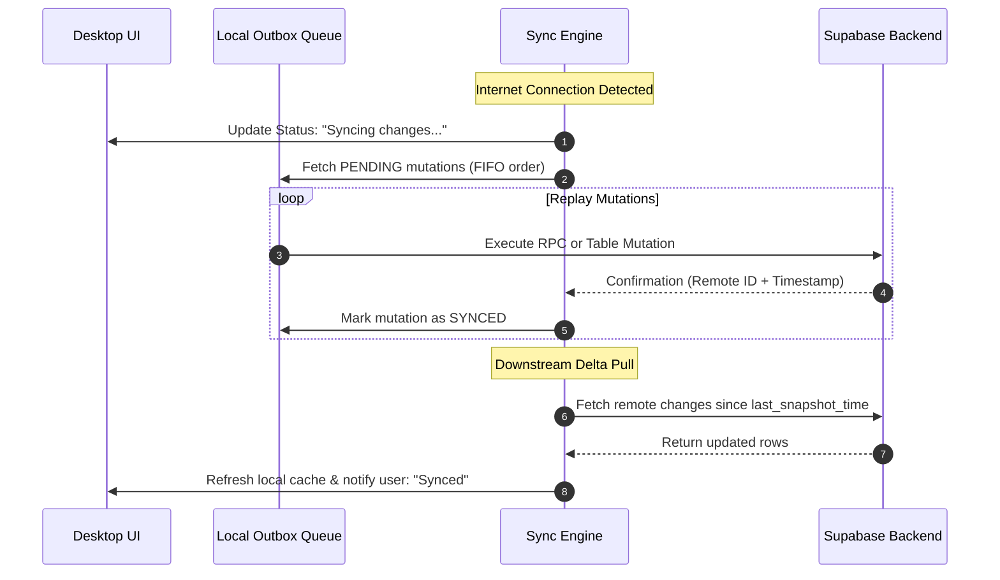

# PRDS Desktop Migration & Offline-First Sync Architecture Guide

**System:** Pharmaceutical Resources Distribution System (PRDS) — City Health Office (CHO) of Naga, Cebu  
**Document Type:** Technical Architecture & Migration Roadmap  
**Target Platform:** Desktop Application (Windows / Cross-Platform) with Offline-First Capability  
**Base Application:** React 19, Vite 8, Tailwind CSS v4, Supabase (PostgreSQL 15)  

---

## 1. Executive Summary & Objective

The City Health Office of Naga, Cebu oversees 28 Barangay Health Stations (BHS). Many of these stations operate in areas with intermittent or absent internet connectivity.

### Primary Goals:
1. **Preserve Existing Codebase & UX:** Retain 100% of the React 19 UI/UX, Tailwind CSS v4 design system, role guards (`PHARMA_II`, `PHARMA_I`, `BHW`), and core business logic with minimal refactoring.
2. **Desktop Application Packaging:** Package the system into a native desktop application with dedicated window management, local system integration, and automatic updates.
3. **Offline-First Operations:**
   - **Startup / Online:** Download and cache an active data snapshot to the local machine.
   - **Offline Mode:** Continue routine operations (dispensing medicines to patients, creating stock requests, recording transfers, viewing stock levels) without internet connection.
   - **Reconnection / Sync:** Automatically detect internet restoration, replay queued local transactions (outbox pattern) to Supabase, resolve any conflicts, and pull remote updates.

---

## 2. Tech Stack Evaluation: Choosing Tauri v2

### 2.1 Desktop Shell Framework Comparison

| Metric | **Tauri v2 (Selected Stack)** | Electron | PWA (Progressive Web App) |
| :--- | :--- | :--- | :--- |
| **Installer Size** | **~10 – 18 MB** (Extremely compact) | ~85 – 120 MB | ~0 MB (Browser cached) |
| **Memory Footprint (RAM)** | **~35 – 60 MB RAM** (Low-spec friendly) | ~150 – 250 MB RAM | Shared with browser |
| **UI Rendering Engine** | **Microsoft Edge WebView2** (Chromium-based, evergreen on Windows 10/11) | Bundled Chromium instance | Browser window |
| **React 19 + Vite 8 Support** | **Native & immediate** (Tauri wraps Vite directly) | Supported via `electron-vite` | Native |
| **Local Database Engine** | **Native SQLite** (`@tauri-apps/plugin-sql`) or Dexie.js | `better-sqlite3` or Dexie.js | IndexedDB only |
| **Developer Prerequisites** | Node.js + Rust (`rustup`) + C++ Build Tools | Node.js only | None |
| **Target Hardware Suitability** | **Exceptional for Barangay Health Station PCs** | Requires modern PCs | Requires browser |

---

### 2.2 Why Tauri v2 is Ideal for PRDS

1. **Optimized for Real-World Barangay Equipment:**  
   Many Barangay Health Stations (BHS) in Naga, Cebu operate on government-issued, budget-grade or older computers with limited RAM (4 GB – 8 GB). Electron's 200MB+ baseline memory footprint can slow down other tasks. Tauri runs at only **~40MB RAM**, leaving almost all system resources free.
2. **True Native SQLite Database via Official Plugin:**  
   With Tauri's official `@tauri-apps/plugin-sql`, the desktop app gets a real, filesystem-backed **SQLite database** (`prds.db`) stored safely in Windows `AppData`. This provides ACID-compliant, crash-resilient local storage that cannot be accidentally cleared like browser cookies or localStorage.
3. **Vite 8 & React 19 First-Class Integration:**  
   Tauri does not change how your React app works. It simply tells Vite to build `prds-web` as usual and displays it inside the native Windows WebView2 window.
4. **Security & Smaller Attack Surface:**  
   Unlike Electron (which exposes full Node.js APIs inside the window), Tauri has a strict capability-based permissions model. JavaScript can only call explicitly allowed plugins (such as SQL or network status).

---

### 2.3 Prerequisites for Developing with Tauri on Windows

Since Tauri compiles a native Windows binary, the development workstation requires:
1. **Microsoft C++ Build Tools:** Available via Visual Studio Community or Visual Studio Build Tools (select *"Desktop development with C++"*).
2. **Rust Compiler (`rustup`):** Downloaded from [rustup.rs](https://rustup.rs/). Run `rustup default stable`.
3. **WebView2 Runtime:** Already built into Windows 10 (version 1803+) and Windows 11.

> **Note:** Once these one-time prerequisites are installed, you do **not** need to write Rust code daily. Tauri v2 handles the native layer through standard npm plugins.

---

### 2.2 Local Database & Sync Architecture

To allow the desktop app to operate offline, data cannot only live in the cloud Supabase PostgreSQL database. A local replica is required.

```
┌─────────────────────────────────────────────────────────────┐
│                      PRDS Desktop UI                        │
│             (React 19 + Tailwind CSS v4 Components)         │
└──────────────────────────────┬──────────────────────────────┘
                               │
                      Unified Data Client
                    (Transparent Data Layer)
                               │
              ┌────────────────┴────────────────┐
              ▼                                 ▼
   ┌──────────────────────┐          ┌──────────────────────┐
   │    Local Store       │          │   Offline Mutation   │
   │  (Dexie.js / SQLite) │          │     Outbox Queue     │
   │   - Snapshot Data    │          │  - Queued Mutations  │
   │   - Instant Reads    │          │  - Queued RPC Calls  │
   └──────────┬───────────┘          └──────────┬───────────┘
              │                                 │
              │         Sync Engine             │
              │     (Background Worker)         │
              │                                 │
              └───────────────┬─────────────────┘
                              │ Reconnect / Pull & Push
                              ▼
   ┌──────────────────────────────────────────────────────────┐
   │                    Supabase Cloud                        │
   │      (PostgreSQL 15, PostgREST, RLS, Stored RPCs)        │
   └──────────────────────────────────────────────────────────┘
```

#### Local Storage Recommendation: **Dexie.js (IndexedDB) + Local Outbox**
1. **Dexie.js (IndexedDB wrapper):**
   - High-performance, indexed, transactional, structured JSON database built into the desktop Webview.
   - Works identically during web development (`npm run dev`) and in the packaged desktop build.
   - Zero native C++ compilation issues on Windows compared to compiled native SQLite drivers.
2. **Alternative for SQLite:** `better-sqlite3` running inside the Electron main process if relational SQL queries on the desktop filesystem are preferred.

---

## 3. Project Directory Architecture: Complete Isolation

### 3.1 Strict Isolation Principle
To guarantee the stability of the live web system:
- **`prds-web/` remains 100% UNTOUCHED:** No files, dependencies, build scripts, or code inside `prds-web/` will be altered. It remains the pure, production web application.
- **`prds-desktop/` is a Completely Independent Project:** It has its own `package.json`, its own `node_modules`, its own Vite configuration, and its own `src-tauri/` native directory.
- **Desktop-Specific Innovations Isolated:** All offline-first sync logic (`src/backend/sync/`), SQLite persistence, and Tauri plugins reside solely within `prds-desktop/`.

```
prds/
├── prds-web/                      # UNTOUCHED: Existing Web Application (Vite 8 + React 19)
│   ├── src/
│   ├── package.json
│   └── vite.config.js
│
├── prds-desktop/                  # INDEPENDENT: Standalone Desktop Project (Tauri v2 + SQLite)
│   ├── src-tauri/                 # Native Rust / Tauri Configuration
│   │   ├── Cargo.toml             # Rust dependencies (tauri v2, tauri-plugin-sql)
│   │   ├── tauri.conf.json        # Window settings, bundle identifier, capabilities
│   │   ├── capabilities/          # Security permissions (SQL, network permissions)
│   │   └── src/
│   │       ├── main.rs            # Application entry point
│   │       └── lib.rs             # Tauri plugin registrations
│   │
│   ├── src/                       # Desktop React Application (Isolated from web)
│   │   ├── sync/                  # Offline-First SQLite Sync Engine (Desktop only)
│   │   │   ├── db.js              # Native SQLite connection (@tauri-apps/plugin-sql)
│   │   │   ├── syncEngine.js      # Push/Pull coordinator
│   │   │   ├── outboxQueue.js     # FIFO mutation replay queue
│   │   │   ├── networkStatus.js   # Online/offline detector + heartbeat
│   │   │   └── conflictHandler.js # Conflict resolution policies
│   │   │
│   │   ├── services/
│   │   │   ├── dataClient.js      # Unified wrapper (Supabase + Local SQLite)
│   │   │   └── supabase.js        # Supabase client instance
│   │   │
│   │   ├── context/               # AuthProvider + SyncStatusProvider
│   │   ├── components/            # UI components (includes SyncStatusBadge)
│   │   ├── views/                 # Route-level feature modules
│   │   └── App.jsx
│   │
│   ├── package.json               # Independent dependencies & scripts: "tauri dev", "tauri build"
│   └── vite.config.js             # Independent Vite configuration
│
├── database/                      # Supabase SQL schemas & migrations (Shared reference)
└── documentation/                 # Architectural specifications
```

---

## 4. Offline-First & Bidirectional Sync Mechanics

### 4.1 Step 1: Initial Snapshot Retrieval (Online Boot)
When the application starts with an active internet connection:
1. User logs in (credentials and JWT session are safely cached locally in encrypted store).
2. The Sync Engine triggers an initial snapshot fetch based on the user's role and facility:
   - `facilities` (all active facilities)
   - `medicines` (full drug catalog, strengths, dosages)
   - `suppliers` (active suppliers)
   - `inventory` (scoped to the facility, or all for CHO)
   - `patients` (facility-registered patients)
   - `monthly_dispensing_summary` (consumption trends)
3. The data is written to the local database with a timestamp tag: `last_snapshot_time = now()`.

### 4.2 Step 2: Offline Operation & Local Storage (Offline Mode)
When internet connectivity is unavailable:
1. **Reads:** The application reads from the local IndexedDB/SQLite database instantly with 0ms network latency. Search, filtering, and table pagination remain fully operational.
2. **Writes & Mutations (The Outbox Pattern):**
   - When a user performs an action (e.g., dispensing medicine via `dispense_walk_in` or submitting a stock request):
     - **Optimistic Local Update:** Local inventory batch quantities are deducted immediately; the patient dispensing record is created locally with a temporary UUID.
     - **Outbox Enqueue:** A mutation payload is appended to `offline_mutation_queue`:
       ```json
       {
         "id": "uuid-v4",
         "created_at": "2026-09-17T16:30:00Z",
         "user_id": "user-uuid",
         "facility_id": "facility-uuid",
         "type": "RPC",
         "target": "dispense_walk_in",
         "payload": {
           "p_facility_id": "...",
           "p_patient_id": "...",
           "p_items": [{ "inventory_id": "...", "quantity": 10 }]
         },
         "status": "PENDING",
         "retry_count": 0
       }
       ```
3. **UI Feedback:** A non-intrusive status pill in the header displays:  
   `🟡 Working Offline (3 unsynced actions)`.

### 4.3 Step 3: Connection Detection & Heartbeat
- Relies on `navigator.onLine` and `window.addEventListener("online")`.
- Additionally performs a lightweight ping every 15–30 seconds against the Supabase REST health endpoint (`/rest/v1/`) to avoid false positives (e.g., connected to Wi-Fi without WAN access).

### 4.4 Step 4: Bidirectional Synchronization (Reconnection)
Once internet is verified:



1. **Upstream Sync (Push Phase):**
   - The Sync Engine processes items in `offline_mutation_queue` chronologically (FIFO).
   - Calls the respective Supabase RPC or table mutation.
   - On success, marks the item `SYNCED` and updates the local record with any server-generated IDs.
2. **Downstream Sync (Pull Phase):**
   - Fetches updated records from Supabase where `updated_at > last_snapshot_time`.
   - Merges updates into the local cache.
3. **Realtime Re-establishment:**
   - Resubscribes to Supabase Realtime channels (`inventory-sync`, `notifications-sync`).
4. **UI Notification:**
   - Status pill turns green: `🟢 Online (All data synchronized)`.

### 4.5 Step 5: Conflict Resolution Policies

| Data Category | Operation | Resolution Strategy |
| :--- | :--- | :--- |
| **Dispensing Records** | New records | **Append-Only:** No conflict. Server accepts record with client-recorded dispensing timestamp. |
| **Patient Registration** | New patient | **Unique Identification:** Match by PhilHealth ID or name/DOB; merge if already created remotely. |
| **Medicine Requests** | Create request | **Append-Only:** Request enters `PENDING` status on server. |
| **Stock Transfers** | Status transition | **State Machine Check:** If another user already approved/cancelled the transfer, notify user via Audit Log. |
| **Inventory Batches** | Stock adjustment | **Authoritative Server Check:** Server RPC verifies if quantity is sufficient. If batch is depleted by another station, queue flags item as `NEEDS_REVIEW` and notifies Pharmacist. |

---

## 5. Step-by-Step Migration Roadmap

### Phase 1: Preparation & Local Data Layer
- [ ] Initialize Dexie.js database schema matching the 21 Supabase PostgreSQL tables.
- [ ] Create `PRDSDataClient` wrapper that routes queries to local Dexie.js and writes to both local DB and `offline_mutation_queue`.
- [ ] Add offline authentication session persistence (encrypted local credential/token store).

### Phase 2: Offline Outbox & Sync Engine
- [ ] Build `outboxQueue.js` with persistent FIFO storage.
- [ ] Implement network status detector with active heartbeat check.
- [ ] Implement `syncEngine.js` handling the two-phase push (outbox replay) and pull (delta snapshot).
- [ ] Implement conflict logging and notification feedback in the UI.

### Phase 3: Desktop Shell Scaffolding (`prds-desktop` with Tauri v2)
- [ ] Initialize Tauri v2 in `prds-desktop` (`npm create tauri-app@latest` or `npx @tauri-apps/cli init`).
- [ ] Install official plugins:
  - `@tauri-apps/plugin-sql` (with SQLite feature)
  - `@tauri-apps/plugin-network` (or browser navigator)
  - `@tauri-apps/plugin-updater`
- [ ] Configure `src-tauri/tauri.conf.json` (window sizing, minimum dimensions, app title, icons, permissions).
- [ ] Integrate existing UI components, styling (Tailwind CSS v4), and routes from `prds-web`.

### Phase 4: Verification & Edge Cases
- [ ] Verify offline boot: launch app with Wi-Fi disabled and test login.
- [ ] Verify offline dispensing: record patient dispensing and confirm local SQLite stock deduction.
- [ ] Verify online sync: reconnect internet and confirm Supabase receives the transaction and updates remote tables.
- [ ] Test network drops during an active mutation.

### Phase 5: Packaging & Windows Installer
- [ ] Run `npm run tauri build` to generate production Windows installers:
  - `.msi` (Windows Installer package)
  - `.exe` (NSIS Installer)
- [ ] Verify installer footprint is under ~15 MB and RAM usage is under ~50 MB on launch.

---

## 6. Maintenance & Records
- **Author:** Antigravity AI Engineering Assistant
- **Codebase Reference:** `d:\prds`
- **Initial Target:** Desktop Application Release v1.0.0
