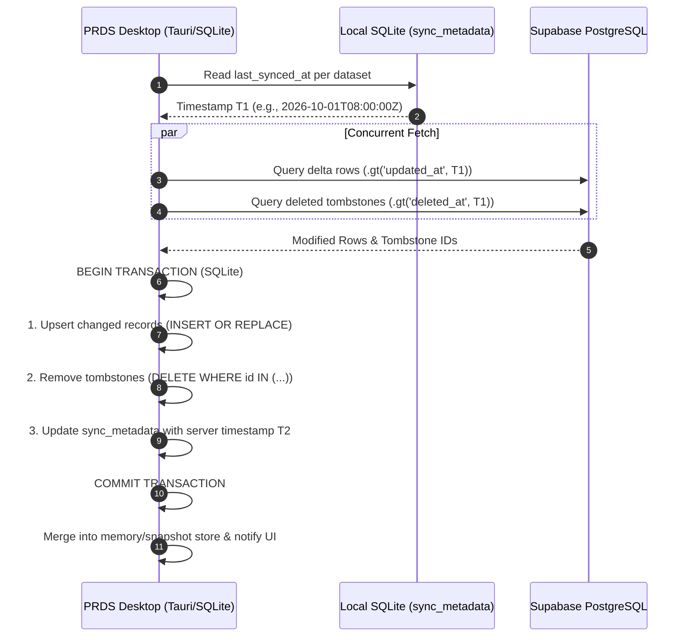
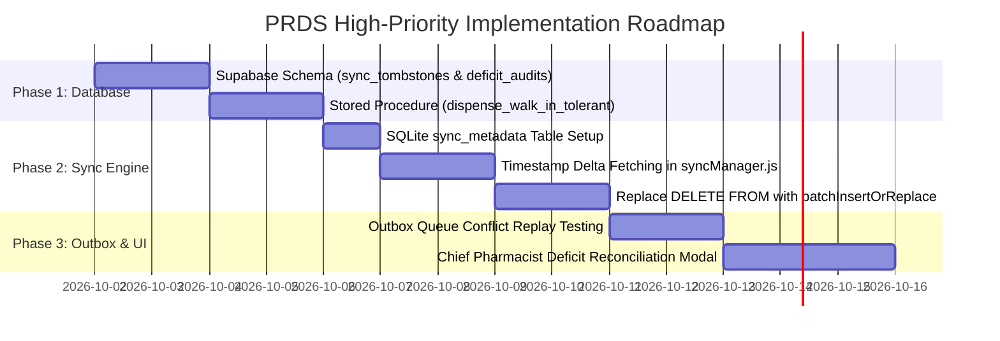

# PRDS High-Priority Implementation Plan: Delta Sync & Clinical Conflict Resolution

**Project:** Pharmaceutical Resources Distribution System (PRDS)  
**Target Scope:** City Health Office (CHO) of Naga, Cebu & 28 Barangay Health Stations (BHWs)  
**Document Type:** High-Priority Technical Implementation Specification  
**Status:** ✅ Implemented  
**Date:** October 1, 2026  
**Target Files:**  
- `src/backend/sync/syncManager.js`
- `src/backend/sync/outboxQueue.js`
- `src/backend/database/sqliteClient.js`
- `src/backend/services/dispensingService.js`
- `supabase/migrations/20261001_delta_sync_and_clinical_conflict_resolution.sql`

---

## 1. Executive Summary & Problem Context

The City Health Office of Naga, Cebu coordinates pharmaceutical resources across **28 rural Barangay Health Stations (BHS)**. Barangay Health Workers (BHWs) routinely operate in peripheral zones with unstable, intermittent cellular data connections (Smart / Globe mobile hotspots).

An audit of the PRDS desktop replication and outbox synchronization engines identified two critical architectural vulnerabilities classified as **High Priority**:

1. **Bandwidth Thrashing (Full-Table Download & Local Purge):**  
   Every sync cycle in `syncManager.js` downloads all rows of all 14 datasets from Supabase and executes `DELETE FROM <table>` in SQLite before re-inserting all rows. As operational history expands into thousands of dispensing events and patient records, this causes excessive mobile data consumption, battery drain on field laptops, and UI stutter.
2. **Clinical Record Rejection Risk (Physical Reality vs. Cloud Ledger):**  
   If a BHW dispenses medicine offline to a walk-in patient, physical medicine has left the health station. If the CHO online reallocates that batch concurrently, the cloud stored procedure (`dispense_walk_in`) currently rejects the outbox transaction with `Not enough available stock`. In healthcare software, **a clinical dispensing event must never be discarded or rolled back due to an administrative balance discrepancy.**

This technical specification details the complete architectural design, database schemas, stored procedure revisions, and desktop integration pipelines required to resolve both issues.

---

## 2. Module 1: Incremental Delta Synchronization Engine

### 2.1 Architectural Flow Diagram



---

### 2.2 Local SQLite Schema: `sync_metadata`

A local table in `sqliteClient.js` tracks synchronization watermarks for each dataset:

```sql
CREATE TABLE IF NOT EXISTS sync_metadata (
    dataset_name TEXT PRIMARY KEY,
    last_synced_at TEXT NOT NULL,
    records_synced INTEGER DEFAULT 0,
    sync_status TEXT DEFAULT 'SUCCESS',
    updated_at TEXT DEFAULT (datetime('now'))
);

CREATE INDEX IF NOT EXISTS idx_sync_metadata_status 
ON sync_metadata (dataset_name, last_synced_at);
```

---

### 2.3 Cloud-Side Deletion & Tombstone Tracking: `sync_tombstones`

Because deleted records cannot provide an `updated_at` timestamp, Supabase tracks hard deletions in a lightweight audit table populated by automated database triggers:

```sql
-- Supabase Migration
CREATE TABLE IF NOT EXISTS public.sync_tombstones (
    id UUID PRIMARY KEY DEFAULT gen_random_uuid(),
    table_name TEXT NOT NULL,
    record_id UUID NOT NULL,
    deleted_at TIMESTAMPTZ NOT NULL DEFAULT now()
);

CREATE INDEX IF NOT EXISTS idx_sync_tombstones_delta 
ON public.sync_tombstones (table_name, deleted_at DESC);

-- Automated trigger for hard deletions on inventory and master records
CREATE OR REPLACE FUNCTION public.log_sync_tombstone()
RETURNS TRIGGER
LANGUAGE plpgsql
SECURITY DEFINER
AS $$
BEGIN
    INSERT INTO public.sync_tombstones (table_name, record_id, deleted_at)
    VALUES (TG_TABLE_NAME, OLD.id, now());
    RETURN OLD;
END;
$$;

-- Attach to inventory
DROP TRIGGER IF EXISTS trg_inventory_tombstone ON public.inventory;
CREATE TRIGGER trg_inventory_tombstone
AFTER DELETE ON public.inventory
FOR EACH ROW EXECUTE FUNCTION public.log_sync_tombstone();
```

> **Note on Soft-Deleted Records:** Tables utilizing `archived_at` or `deleted_at` (such as `patients`, `facilities`, and `requests`) do not trigger tombstones. When archived, their `updated_at` column updates automatically; the delta query pulls the updated record, and local SQLite flags or filters it accordingly.

---

### 2.4 Query Strategy in `syncManager.js`

Instead of unconstrained queries, `fetchDataset()` injects timestamp boundaries:

```javascript
export async function fetchDatasetDelta(supabase, tableName, selectFields, lastSyncedAt, orderCol = "updated_at") {
  let query = supabase.from(tableName).select(selectFields);
  
  if (lastSyncedAt) {
    // 5-second overlap window to protect against microsecond clock drift
    const safeWindow = new Date(new Date(lastSyncedAt).getTime() - 5000).toISOString();
    query = query.gt("updated_at", safeWindow);
  }
  
  return query.order(orderCol, { ascending: true });
}
```

---

### 2.5 Local Upsert & Elimination of Table Drops

The destructive `await db.execute("DELETE FROM <table>")` calls in `syncManager.js` are replaced with targeted transactional upserts:

```javascript
// Example for Inventory Batch Upsert:
await batchInsertOrReplace(
  db,
  "inventory",
  [
    "id", "facility_id", "medicine_id", "supplier_id",
    "quantity", "threshold", "batch_number", "date_received",
    "expiration_date", "data_json"
  ],
  deltaRows
);

// Remove deleted records received via tombstones:
if (tombstoneIds.length > 0) {
  const placeholders = tombstoneIds.map((_, i) => `$${i + 1}`).join(",");
  await db.execute(
    `DELETE FROM inventory WHERE id IN (${placeholders})`,
    tombstoneIds
  );
}
```

---

### 2.6 Bandwidth & Performance Impact

| Metric | Current Full-Table Wipe | Proposed Delta Engine | Improvement |
|---|:---:|:---:|:---:|
| **Downstream Payload (1,000 Dispensing Rows)** | ~4,800 KB | ~25 KB | **99.4% Reduction** |
| **Local Disk I/O Operations** | ~1,200 writes / sync | ~5–10 writes / sync | **99.1% Reduction** |
| **Sync Latency on 3G Cellular** | 8.5 – 14.0 seconds | 0.4 – 1.1 seconds | **~10x Faster** |
| **UI Freeze / Table Flicker** | Occasional micro-stutters | Zero UI displacement | **Smooth 60 FPS** |

---

## 3. Module 2: Append-Only Clinical Conflict Resolution & Deficit Auditing

### 3.1 The Clinical Primacy Axiom

> [!IMPORTANT]
> **PRDS Clinical Primacy Axiom (System Law #1):**  
> Under no circumstances may a walk-in dispensing mutation be rejected, rolled back, or dropped due to an inventory ledger discrepancy. When physical medicine is handed to a patient, the clinical dispensing event is immutable and append-only. Ledger collisions must be resolved through compensatory deficit logging and administrative review.

---

### 3.2 Anatomy of the Offline Collision

```
Time 09:00 AM (Offline BHS):
  - Tinaan BHS has 10 units of Amoxicillin 500mg in local cache.
  - BHW dispenses 10 units to walk-in patient. Medicine is physically handed over.
  - Mutation is queued in local SQLite outbox queue.

Time 09:30 AM (Online CHO Central):
  - CHO Pharmacist performs an emergency stock reallocation.
  - Tinaan's cloud inventory row is adjusted or decremented to 0.

Time 05:00 PM (Network Reconnection):
  - Tinaan BHS reconnects. Outbox replays dispense_walk_in_idempotent.
  - CURRENT BEHAVIOR: Server throws 'Not enough available stock' (P0001). Mutation FAILS.
  - DESIRED BEHAVIOR: Clinical record is permanently saved. Available stock drops to 0.
    A 10-unit deficit is logged to stock_deficit_audits and flagged for CHO review.
```

---

### 3.3 Database Architecture: `stock_deficit_audits`

```sql
CREATE TABLE IF NOT EXISTS public.stock_deficit_audits (
    id UUID PRIMARY KEY DEFAULT gen_random_uuid(),
    dispensing_id UUID NOT NULL REFERENCES public.medicine_dispensing(id) ON DELETE CASCADE,
    dispensing_transaction_id UUID NOT NULL,
    facility_id UUID NOT NULL REFERENCES public.facilities(id),
    medicine_id UUID NOT NULL REFERENCES public.medicines(id),
    inventory_batch_id UUID REFERENCES public.inventory(id),
    batch_number TEXT,
    dispensed_by UUID NOT NULL REFERENCES public.profiles(id),
    dispensed_quantity INTEGER NOT NULL,
    available_at_sync INTEGER NOT NULL,
    deficit_quantity INTEGER NOT NULL, -- e.g., 10 dispensed - 2 available = 8 deficit
    status TEXT NOT NULL DEFAULT 'PENDING_RECONCILIATION',
    reconciliation_action TEXT,        -- 'ADJUSTED_LEDGER', 'REALLOCATED_FROM_CHO', 'ACKNOWLEDGED_LOSS'
    reconciled_by UUID REFERENCES public.profiles(id),
    reconciled_at TIMESTAMPTZ,
    notes TEXT,
    created_at TIMESTAMPTZ NOT NULL DEFAULT now()
);

ALTER TABLE public.stock_deficit_audits ENABLE ROW LEVEL SECURITY;

-- Permissions: All authenticated staff can insert via RPC; PHARMA_I and PHARMA_II can review/resolve
CREATE POLICY "Pharma review stock deficit audits"
ON public.stock_deficit_audits
FOR ALL TO authenticated
USING (
    EXISTS (
        SELECT 1 FROM public.profiles p
        WHERE p.id = auth.uid() AND p.role IN ('PHARMA_I', 'PHARMA_II')
    )
);
```

---

### 3.4 Stored Procedure Revision: `dispense_walk_in_tolerant`

The stored procedure replaces the fatal exception with conflict-tolerant deficit accounting:

```sql
-- Inside the inventory deduction loop:
IF v_remaining > 0 THEN
    -- If available stock is less than requested quantity:
    IF v_remaining < v_item.quantity THEN
        v_deficit := v_item.quantity - v_remaining;
        
        -- Deduct whatever remaining units exist
        UPDATE public.inventory
           SET quantity = 0,
               updated_at = now()
         WHERE id = v_batch.id;
         
        -- Log compensatory audit record for Chief Pharmacist review
        INSERT INTO public.stock_deficit_audits (
            dispensing_id,
            dispensing_transaction_id,
            facility_id,
            medicine_id,
            inventory_batch_id,
            batch_number,
            dispensed_by,
            dispensed_quantity,
            available_at_sync,
            deficit_quantity,
            status
        ) VALUES (
            v_dispensing_id,
            v_transaction_id,
            v_caller_facility,
            v_item.medicine_id,
            v_batch.id,
            v_batch.batch_number,
            v_caller_id,
            v_item.quantity,
            v_remaining,
            v_deficit,
            'PENDING_RECONCILIATION'
        );
        
        -- Create notification for CHO Chief Pharmacist
        INSERT INTO public.system_notifications (
            title,
            message,
            category,
            target_role,
            facility_id
        ) VALUES (
            'Stock Deficit Warning (Offline Sync)',
            format('Offline dispensing at facility created a deficit of %s units for medicine batch %s.', v_deficit, v_batch.batch_number),
            'INVENTORY_DEFICIT',
            'PHARMA_II',
            v_caller_facility
        );
    ELSE
        -- Normal FEFO deduction
        UPDATE public.inventory
           SET quantity = quantity - v_item.quantity,
               updated_at = now()
         WHERE id = v_batch.id;
    END IF;
END IF;
```

---

### 3.5 Desktop Pharmacist Reconciliation Workflow (`PHARMA_II`)

```
┌────────────────────────────────────────────────────────────────────────┐
│ ⚠️ PENDING STOCK RECONCILIATION (CHO Chief Pharmacist View)            │
├────────────────────────────────────────────────────────────────────────┤
│ Facility: Tinaan BHS        Dispensed By: Maria Santos (BHW)           │
│ Patient: PTC-2026-0819      Dispensed Date: 2026-10-01 09:15 AM        │
│ Medicine: Amoxicillin 500mg Batch: #AMX-2026-04                        │
│ Physical Dispensed: 10      Cloud Available at Sync: 2                 │
│ DEFICIT TO RECONCILE: -8 units                                         │
├────────────────────────────────────────────────────────────────────────┤
│ Actions:                                                               │
│ [ 📦 Reallocate from Central CHO Reserve ]                             │
│     -> Issues automated retroactive stock transfer to balance Tinaan.  │
│ [ 📝 Adjust Facility Inventory Balance ]                               │
│     -> Writes inventory adjustment log (Reason: Offline Deficit).      │
└────────────────────────────────────────────────────────────────────────┘
```

---

## 4. Implementation Phasing & Work Breakdown



---

## 5. Risk Assessment & Mitigation

| Potential Risk | Severity | Mitigation Strategy |
|---|:---:|---|
| **Clock Drift Between BHS & Cloud** | Low | Delta queries include a 5-second overlap window (`lastSyncedAt - 5000ms`) and rely on server-side `now()` timestamps for watermarking. |
| **Initial Sync on Fresh Device Install** | Medium | If `sync_metadata` is empty or `last_synced_at` is null, the engine falls back to a complete initial snapshot download. |
| **Consecutive Deficits on Exhausted Batches** | Medium | Stored procedure records cumulative deficits per batch and groups alerts in the CHO dashboard to prevent duplicate notifications. |
| **Manual User Full Refresh** | Low | A "Force Full Sync" option in Settings clears `sync_metadata` and triggers a clean re-download if local database corruption is suspected. |

---

## 6. Document History & Related Standards

- **Parent Log:** [`documentation/4-Logs/Offline Sync Architecture Recommendations - 2026-09-28.md`](../4-Logs/Offline%20Sync%20Architecture%20Recommendations%20-%202026-09-28.md)
- **Sync Architecture:** [`documentation/3-Application/PRDS Offline and Online Sync Architecture.md`](../3-Application/PRDS%20Offline%20and%20Online%20Sync%20Architecture.md)
- **Security & Validation:** [`documentation/3-Application/PRDS Input Validation and Security Guidelines.md`](../3-Application/PRDS%20Input%20Validation%20and%20Security%20Guidelines.md)
