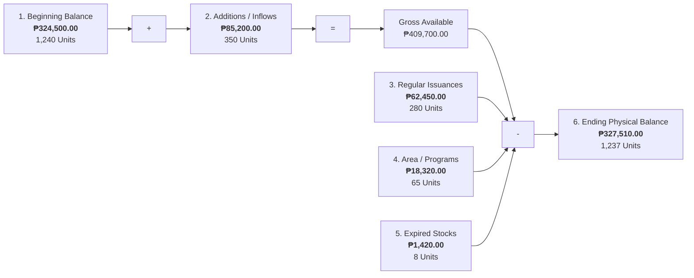
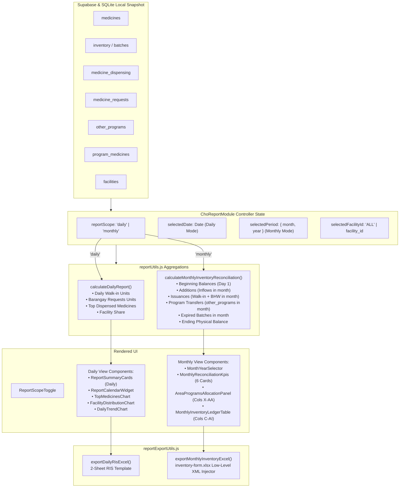

# Report Module UI Enhancement Plan: Dual-Scope Filtering & Monthly Inventory Representation

> **Document Type:** UI/UX Architecture & Feature Enhancement Plan  
> **Target Module:** PRDS Desktop — Report Module (`prds-desktop/src/frontend/views/reports`)  
> **Target Users:** City Health Office (CHO) Pharmacists (`PHARMA_II`, `PHARMA_I`), CHO Head Doctor, BHWs  
> **Companion Documents:**
> - [CHO Inventory Physical Count Report Plan and Analysis.md](file:///d:/prds/documentation/1-Planning/CHO%20Inventory%20Physical%20Count%20Report%20Plan%20and%20Analysis.md)
> - [Report Module UI Design Instructions.md](file:///d:/prds/documentation/1-Planning/Report%20Module%20UI%20Design%20Instructions.md)
> - [Report Module Feature Plan.md](file:///d:/prds/documentation/1-Planning/Report%20Module%20Feature%20Plan.md)
> **Source Excel Templates:**
> - Monthly Physical Count: [`inventory-form.xlsx`](file:///d:/prds/prds-desktop/src/frontend/assets/templates-excel/inventory-form.xlsx)
> - Daily Dispensing Slip: [`RIS-Template.xlsx`](file:///d:/prds/prds-desktop/src/frontend/assets/templates-excel/RIS-Template.xlsx)
> **Status:** Planning & Architectural Review (No code changes implemented until plan sign-off)

---

## 1. Executive Summary & Problem Statement

### 1.1 The Current UI Disconnect
The PRDS Report Module export engine has been successfully upgraded to achieve 100% pixel-perfect fidelity with the official City Health Office (CHO) Excel templates:
1. **Daily RIS Export:** Generates the official 2-sheet workbook (`PHARMACY DISPENSING` for walk-ins and `BARANGAY HEALTH STATIONS` for health centers).
2. **Monthly Inventory Count Export:** Reconciles the entire monthly inventory ledger across Columns C through AI in [`inventory-form.xlsx`](file:///d:/prds/prds-desktop/src/frontend/assets/templates-excel/inventory-form.xlsx).

**However, there is a fundamental gap in the desktop frontend interface:**
- **Daily-Only Filtering:** The UI currently only features a daily date picker (`ReportCalendarWidget`). There is **no mechanism in the interface to select or filter by Month and Year** for the monthly scope.
- **Missing On-Screen Representation of Monthly Fields:** Key accounting stages from the official monthly inventory form—most notably **`AREA / PROGRAM`** (outreach health campaigns such as Anti-Rabies, Operation Tuli, Mobile Dental Clinic, Mass Deworming)—are completely invisible in the dashboard UI.
- **Hidden Inflows and Reconciliations:** Data on beginning balances, procurement additions, regular walk-in issuances vs. program transfers, expired stock write-offs, and physical count remainders are computed behind the scenes for export, but pharmacists **cannot preview or audit them interactively on-screen**.

### 1.2 Core Objectives of this Enhancement
1. **Implement Dual-Scope View Mode:** Provide an intuitive segmented scope toggle:
   - **`📋 Daily Operations (RIS)`**: Daily walk-in dispensing, barangay requests, and daily operational metrics.
   - **`📊 Monthly Physical Count (Inventory Form)`**: Full monthly inventory reconciliation, stock movements, and outreach program audit.
2. **Introduce Dedicated Monthly Cadence Filtering:** Provide a structured Month & Year selector with quick-navigation controls (`This Month`, `Previous Month`, `Quarterly presets`).
3. **Bring the 5-Stage Accounting Flow to the UI:** Display dedicated Monthly KPI summary cards reflecting Opening Valuation, Stock Additions, Regular Issuances, Program Transfers, Expired Losses, and Net Ending Physical Valuation.
4. **Build a Dedicated `AREA / PROGRAM` Visualizer:** Create an interactive UI section showcasing how municipal medicine stocks were distributed across specialized public health programs.
5. **Interactive On-Screen Ledger Preview:** Render a responsive, high-density data table matching the columns of [`inventory-form.xlsx`](file:///d:/prds/prds-desktop/src/frontend/assets/templates-excel/inventory-form.xlsx), complete with search, category filtering, and discrepancy indicators before exporting.

---

## 2. Current State vs. Target State Audit

The table below contrasts the current frontend implementation with the proposed enhancements:

| Feature / UI Dimension | Current State (`ChoReportModule.jsx`) | Planned Target State |
| :--- | :--- | :--- |
| **View Scope Switching** | None. Single static screen blending daily charts. | **Dual-Scope Segmented Control:**<br/>`[ 📋 Daily Operations (RIS) ]`<br/>`[ 📊 Monthly Physical Count (Form) ]` |
| **Cadence / Date Filtering** | Single-date day picker (`ReportCalendarWidget`). | **Scope-Adaptive Date Bar:**<br/>- *Daily Mode:* Day calendar + `< Today >`<br/>- *Monthly Mode:* Month/Year Dropdown + Quick Presets (`Previous Month`, `Current Month`) |
| **Top KPI Metrics** | 4 Daily Cards (Dispensed Units Today, Medicine Cost Today, Remaining Stock Value, Low Stock Count). | **Scope-Adaptive KPIs:**<br/>- *Daily:* Daily Units, Cost, Walk-in vs. BHW split, Critical Stock.<br/>- *Monthly:* Beginning Valuation, Additions, Total Issued, **Transferred to Programs**, Expired Losses, Ending Physical Valuation. |
| **Area / Program Representation** | **None.** `other_programs` is fetched into memory but never rendered on screen. | **Dedicated Area / Program Panel:**<br/>- Visual cards for each active health campaign.<br/>- Units & ₱ value allocated per program.<br/>- Program breakdown donut/bar chart.<br/>- Filter chips to inspect program medicines. |
| **On-Screen Ledger Table** | None. Users must download Excel to see row-by-row figures. | **Interactive Monthly Ledger Preview:**<br/>- Full high-density table matching Cols C–AI.<br/>- Search by medicine name, brand, lot number.<br/>- Sticky headers and frozen item descriptions.<br/>- Collapsible column groups (Summary vs. Detailed). |
| **Visual Charts** | Top 5 Medicines, Facility Distribution, 30-day Daily Trend. | **Scope-Tailored Visual Intelligence:**<br/>- *Daily:* Top Dispensed Items, Facility Share.<br/>- *Monthly:* Stock Flow Waterfall, Program Allocation Breakdown, Inflow vs. Outflow Dynamics. |
| **Export Action** | Top-right dropdown button. | Enhanced export bar with **one-click contextual export** and pre-export validation summary. |

---

## 3. High-Level UI Layout & Wireframes

### 3.1 Overall Page Wireframe (Monthly Physical Count Active)

```
+---------------------------------------------------------------------------------------------------------------------------------------------------+
| [PRDS HEADER]  Reports & Distribution Ledger                                                                      Facility: Vicente Mendiola (CHO)|
|                Statutory pharmaceutical dispensing and physical inventory reconciliation                         Role: Pharmacist II (Admin)      |
+---------------------------------------------------------------------------------------------------------------------------------------------------+
|                                                                                                                                                   |
| [1. SCOPE SWITCHER & CADENCE TOOLBAR]                                                                                                             |
| +---------------------------------------------------------+   +------------------------------------+   +----------------------------------------+ |
| | ( ) Daily Operations (RIS)  |  (*) Monthly Physical Count|   | Month: [ October  v ] Year: [ 2026 ]|   | [ < Prev Month ] [ Current ] [ Next > ]| |
| +---------------------------------------------------------+   +------------------------------------+   +----------------------------------------+ |
|                                                                                                                                                   |
| [2. 6-STAGE RECONCILIATION KPI CARDS]                                                                                                             |
| +-------------------+ +-------------------+ +-------------------+ +-------------------+ +-------------------+ +----------------------------------+ |
| | 1. BEGINNING BAL  | | 2. ADDITIONS      | | 3. REGULAR ISSUED | | 4. AREA / PROGRAM | | 5. EXPIRED LOSSES | | 6. REMAINING BALANCE (ON HAND)   | |
| |    ₱ 324,500.00   | |    ₱ 85,200.00    | |    ₱ 62,450.00    | |    ₱ 18,320.00    | |    ₱ 1,420.00     | |    ₱ 327,510.00                  | |
| |    1,240 Units    | |    350 Units      | |    280 Units      | |    65 Units       | |    8 Units        | |    1,237 Physical Units          | |
| |    As of Sep 30   | |    Procured/DOH   | |    Walk-in + BHW  | |    5 Active Drives| |    Quarantined    | |    Status: [ BALANCED (OK) ]     | |
| +-------------------+ +-------------------+ +-------------------+ +-------------------+ +-------------------+ +----------------------------------+ |
|                                                                                                                                                   |
| [3. AREA & HEALTH PROGRAMS ALLOCATION SECTION]                                                                                                    |
| +-----------------------------------------------------------------------------------+ +-----------------------------------------------------------+ |
| | ACTIVE OUTREACH HEALTH PROGRAMS (Cols X - AA)                                     | | PROGRAM STOCK ALLOCATION BREAKDOWN                        | |
| | [Anti-Rabies Drive]       ₱ 8,450.00  (25 Vials Rabies Vaccine, Verorab)          | |  ■ Anti-Rabies (46.1%)                                    | |
| | [Operation Tuli 2026]     ₱ 4,120.00  (15 Boxes Lidocaine, Amoxicillin)           | |  ■ Operation Tuli (22.5%)                                 | |
| | [Mobile Dental Mission]   ₱ 2,800.00  (12 Boxes Mefenamic, Co-Amox)               | |  ■ Mobile Dental (15.3%)                                  | |
| | [Mass Deworming (DepEd)]  ₱ 1,950.00  (100 Bottles Albendazole 400mg)             | |  ■ Mass Deworming (10.6%)                                 | |
| | [Schistosomiasis Control] ₱ 1,000.00  (30 Strips Praziquantel)                    | |  ■ Other (5.5%)                                           | |
| +-----------------------------------------------------------------------------------+ +-----------------------------------------------------------+ |
|                                                                                                                                                   |
| [4. INTERACTIVE MONTHLY INVENTORY LEDGER PREVIEW]                                                                                                 |
| Search: [ Search medicine, brand, lot no... ]  Filter: [ All Items v ]  Category: [ All v ]  View Mode: [ Full Ledger (Cols C-AI) | Condensed v ]   |
| +----+----------------------+-------+------------+-----------+--------------+--------------+--------------+------------------+------------------+ |
| | #  | Medicine Description | Unit  | Lot No.    | Expiry    | Beginning    | Additions    | Issuances    | Area / Program   | Ending Balance   | |
| +----+----------------------+-------+------------+-----------+--------------+--------------+--------------+------------------+------------------+ |
| | 1  | Losartan 50 mg Tab   | TAB   | LOT-8821   | 2027-05   | 500 (₱1,750) | 200 (₱700)   | 320 (₱1,120) | 50 [Dental]      | 330 (₱1,155)     | |
| | 2  | Co-Amoxiclav 625 mg  | TAB   | B-99410    | 2026-12   | 180 (₱2,700) | 0   (₱0)     | 65  (₱975)   | 20 [Tuli Drive]  | 95  (₱1,425)     | |
| | 3  | Rabies Vaccine 2.5IU | VIAL  | RV-2026-01 | 2027-08   | 40  (₱16,000)| 20  (₱8,000) | 15  (₱6,000) | 25 [Anti-Rabies] | 20  (₱8,000)     | |
| +----+----------------------+-------+------------+-----------+--------------+--------------+--------------+------------------+------------------+ |
| [Summary: Showing 48 medicines | Total Valuation: ₱327,510.00]                       [ Export Monthly Inventory Form (.xlsx) ]                            |
+---------------------------------------------------------------------------------------------------------------------------------------------------+
```

---

## 4. Detailed Component Specifications

### 4.1 Component 1: `ReportScopeToggle.jsx` (Dual-Scope Navigation)
- **Role:** Allows the user to toggle seamlessly between operational daily logs and statutory monthly reconciliation.
- **Design Tokens:**
  - Active Scope: `bg-[#00a36c] text-white shadow-xs font-semibold`
  - Inactive Scope: `bg-white text-[#42474e] hover:text-[#0d1117] hover:bg-[#f8f9ff]`
  - Container: `bg-[#f7f6f3] p-1 border border-[#d8dadc] rounded-xl flex items-center gap-1`
- **State Properties:**
  - `scope`: `'daily' | 'monthly'`
  - `onScopeChange(newScope)`
- **Behavior:**
  - When switching to `'daily'`, the UI displays the daily calendar widget, daily metrics, and daily distribution charts.
  - When switching to `'monthly'`, the UI displays the month-year selector, the 6-stage reconciliation KPIs, the Area/Program panel, and the interactive monthly ledger table.

---

### 4.2 Component 2: `MonthYearSelector.jsx` (Monthly Period Controller)
- **Role:** Replaces the day calendar when in Monthly mode, allowing the pharmacist to select any calendar month and year.
- **Visual Controls:**
  1. **Month Dropdown:** Full month names (`January` through `December`).
  2. **Year Dropdown:** Current year, past 5 years, next 2 years (e.g., `2021`–`2028`).
  3. **Quick Jump Buttons:**
     - `[ < Previous Month ]`: Moves one month backward.
     - `[ Current Month ]`: Jumps immediately to today's month.
     - `[ Next Month > ]`: Moves one month forward.
  4. **Reporting Range Anchor Tag:**
     - Displays formatted coverage dates: e.g., *"Reporting Period: October 1, 2026 to October 31, 2026 (31 Days)"*.
     - Shows the Prior Balance Anchor Date: *"Beginning Balance As of: September 30, 2026"*.

---

### 4.3 Component 3: `MonthlyReconciliationKpis.jsx` (The 5-Stage Accounting Flow)
In [`inventory-form.xlsx`](file:///d:/prds/prds-desktop/src/frontend/assets/templates-excel/inventory-form.xlsx), the monthly ledger follows an exact conservation-of-inventory equation:

$$\text{Ending Remaining Balance} = \text{Beginning Balance} + \text{Additions} - (\text{Issuances} + \text{Program Transfers} + \text{Expired Losses})$$

To provide instant operational clarity, the top of the monthly view presents 6 cards:



#### Card Breakdown:
1. **Card 1: Beginning Balance (Opening Stock)**
   - Metric: Total Unit Count & Cumulative Valuation ($\sum K$).
   - Subtext: *"As of prior month close (e.g. Sep 30, 2026)"*.
   - Accent: Neutral Slate / Charcoal (`border-[#d8dadc]`).
2. **Card 2: Additional Stocks (Inflows)**
   - Metric: Procured, DOH/NGO Donations, Barangay Returns ($\sum N$).
   - Subtext: *"New stock delivered this month"*.
   - Accent: Blue tint (`text-blue-700 bg-blue-50/50`).
3. **Card 3: Regular Issuances (Healthcare Delivery)**
   - Metric: Walk-in Pharmacy Dispensing + Barangay Consultation Orders ($\sum V$).
   - Subtext: *"Direct patient consumption"*.
   - Accent: Emerald tint (`text-[#00a36c] bg-emerald-50/50`).
4. **Card 4: Transferred to Other Programs (`AREA / PROGRAM`)**
   - Metric: Dedicated outreach health campaign allocation ($\sum Z$).
   - Subtext: *"Stock diverted to 5 outreach drives"*.
   - Accent: Purple/Violet tint (`text-purple-700 bg-purple-50/50`).
5. **Card 5: Expired Stock Losses**
   - Metric: Quarantined / Expired Units ($\sum AE$).
   - Subtext: *"Write-offs & disposal candidates"*.
   - Accent: Amber/Red alert (`text-red-700 bg-red-50/50`).
6. **Card 6: Remaining Balance on Hand (Net Physical Count)**
   - Metric: Net ending stock on hand ($\sum AI$).
   - Subtext: *"Reconciliation Status: 100% Balanced"*.
   - Accent: Solid Emerald border (`border-[#00a36c] bg-emerald-50/30`).

---

### 4.4 Component 4: `AreaProgramsAllocationPanel.jsx` (Special Focus: `AREA / PROGRAM`)

#### Why this is essential:
In [`inventory-form.xlsx`](file:///d:/prds/prds-desktop/src/frontend/assets/templates-excel/inventory-form.xlsx), Columns X through AA track medicines that were not dispensed at the normal pharmacy window, but were allocated to specific public health campaigns. In the database, these are stored in `other_programs` and `program_medicines`. 

The user specifically requested:
> *"Now, there are fields in the excel of the inventory form (which is serves as the monthly repport) that don't have an UI representation in the report module for example the area program we can have also an Ui representation for the report module."*

#### UI Layout of the Area/Program Panel:
The panel is split into two complementary visual columns:

```
+-------------------------------------------------------------------------------------------------------------------------------+
| [HEADER] Transferred to Other Programs & Outreach Campaigns (Excel Columns X - AA)                                             |
|          Special public health drives funded and supplied from CHO central warehouse inventory                               |
+-------------------------------------------------------------------------------------------------------------------------------+
| LEFT COLUMN (60% Width): Active Programs Grid                | RIGHT COLUMN (40% Width): Allocation Distribution Chart        |
|                                                              |                                                                |
| +----------------------------------------------------------+ | +------------------------------------------------------------+ |
| | [Pill: COMPLETED] Anti-Rabies Vaccination Drive          | | |               [DONUT / HORIZONTAL BAR CHART]               | |
| | Target: City Veterinary & Animal Bite Treatment Center   | | |                                                            | |
| | Date: Oct 12, 2026 | Beneficiaries: 140 Citizens         | | |  ■ Anti-Rabies Drive      ₱ 8,450.00  (46.1%)              | |
| | Allocated: 25 Vials Rabies Vaccine, 30 Syringes          | | |  ■ Operation Tuli         ₱ 4,120.00  (22.5%)              | |
| | Total Program Valuation: ₱ 8,450.00                      | | |  ■ Mobile Dental Mission  ₱ 2,800.00  (15.3%)              | |
| +----------------------------------------------------------+ | |  ■ Mass Deworming (DepEd)  ₱ 1,950.00  (10.6%)              | |
|                                                              | |  ■ Schistosomiasis Control  ₱ 1,000.00   (5.5%)              | |
| +----------------------------------------------------------+ | |                                                            | |
| | [Pill: COMPLETED] Operation Tuli 2026                    | | | Total Outreach Allocation:                                 | |
| | Target: Barangay Inayagan Health Station                 | | | ₱ 18,320.00 (65 Total Units Transferred)                   | |
| | Date: Oct 18, 2026 | Beneficiaries: 85 Youths            | | +------------------------------------------------------------+ |
| | Allocated: 15 Boxes Lidocaine 2%, 20 Boxes Amoxicillin   | |                                                                |
| | Total Program Valuation: ₱ 4,120.00                      | | [INTERACTIVE FILTER ACTION]                                  |
| +----------------------------------------------------------+ | Clicking on any program card or chart legend automatically     |
|                                                              | filters the Ledger Preview Table below to display only items   |
| +----------------------------------------------------------+ | assigned to that specific program!                             |
| | [Pill: SCHEDULED] Mobile Dental Mission                  | |                                                                |
| | Target: Barangay Colon Elementary School                 | |                                                                |
| | Date: Oct 26, 2026 | Beneficiaries: 220 Students         | |                                                                |
| | Allocated: 12 Boxes Mefenamic Acid, 10 Btls Betadine     | |                                                                |
| | Total Program Valuation: ₱ 2,800.00                      | |                                                                |
| +----------------------------------------------------------+ |                                                                |
+-------------------------------------------------------------------------------------------------------------------------------+
```

#### Detailed Features:
1. **Program Cards with Health Tags:**
   - Displays Program Name (e.g. `Anti-Rabies Drive`, `Operation Tuli`, `DepEd Deworming`).
   - Displays Program Date and Specific Target Area.
   - Summarizes key medicines transferred with batch-level transparency.
   - Shows total monetary investment per program.
2. **Interactive Cross-Filtering:**
   - Clicking a program card filters the ledger table below, highlighting the rows where `AREA / PROGRAM` (Column AA) matches that program.
   - A clear "Show All Programs" chip resets the view.
3. **Empty State:**
   - If no outreach programs utilized inventory during the selected month, a clean message displays: *"No warehouse inventory transferred to special outreach programs for [Month Year]. All issuances were standard pharmacy walk-in or barangay clinic fulfillments."*

---

### 4.5 Component 5: `MonthlyInventoryLedgerTable.jsx` (Interactive Ledger Table)

#### Role & Importance:
Previously, pharmacists had no way of inspecting the monthly calculation on screen; they were forced to download the Excel workbook, open it in Microsoft Excel, and check whether formulas balanced.

This on-screen ledger provides an interactive, high-density table previewing the exact data that will be exported to [`inventory-form.xlsx`](file:///d:/prds/prds-desktop/src/frontend/assets/templates-excel/inventory-form.xlsx).

#### Column Configuration:
The table offers two view modes:
- **Mode A: Full Audit View (Default):** Includes all 8 accounting sections (Cols C through AI).
- **Mode B: Executive Condensed View:** Shows Item Details, Beginning Balance, Total Outflows, and Ending Balance for quick scanning.

| Column Group | Table Columns | Cell Alignment | Visual Formatting |
| :--- | :--- | :--- | :--- |
| **Identification** | Item No., Medicine Generic Name, Strength, Unit, Brand, Lot No., Expiry Date | Left / Center | Deep Ink `#0d1117`, Monospace for Lot No., Expiry badge (Amber if expiring within 90 days). |
| **Beginning Balance** | Quantity, Unit Cost, Total Cost | Right | Formatted currency `₱ #,##0.00`. |
| **Additions** | Quantity, Unit Cost, Total Cost | Right | Blue subtle text. |
| **Summation** | Gross Available Quantity, Gross Available Total Cost | Right | Bold `#0d1117`. |
| **Less Issuances** | Quantity Dispensed, Total Cost | Right | Emerald subtle text. |
| **Area / Program** | Quantity Transferred, Total Cost, Program Name | Right / Center | Purple program badge (e.g. `[Rabies]`). |
| **Expired** | Quantity Expired, Total Write-off Cost | Right | Red subtle text. |
| **Ending Balance** | Net Remaining Qty, Unit Cost, Net Ending Total Cost | Right | Bold Emerald, Stock Health Status Pill (`In Stock`, `Low`, `Depleted`). |

#### Interactive Table Toolbar:
1. **Search Input:** Real-time filter across Generic Name, Brand Name, and Lot Number.
2. **Category / Program Dropdown:** Filter by medicine category or specific health program.
3. **Stock Level Filter:** Quick filter pills (`All (48)`, `Low Stock (3)`, `Expiring Soon (2)`, `Program Transferred (12)`).
4. **Frozen Header & First Columns:** The `Item No.` and `Medicine Description` columns remain frozen on the left when scrolling horizontally across the extensive accounting sections.

---

### 4.6 Component 6: `ReportHeader.jsx` Integration & Export Modal

#### Context-Aware Export Controls:
- **When in Daily Mode:**
  - Primary button: **`Export Daily RIS (.xlsx)`** (Generates the 2-sheet Daily Request and Issuance Slip for the selected day).
- **When in Monthly Mode:**
  - Primary button: **`Export Monthly Inventory Form (.xlsx)`** (Generates the statutory Physical Count of Inventories workbook for the selected month and year).
  - Secondary button: **`Export Summary PDF`** (Optional printable executive summary).

#### Export Confirmation & Legal Compliance Notice:
Clicking the export button opens a pre-flight drawer/modal:
- Summary of records to be generated (e.g., *"Exporting 48 medicine batches for the period of October 1–31, 2026"*).
- Financial Reconciliation Summary:
  - Total Beginning: `₱ 324,500.00`
  - Total Inflows: `₱ 85,200.00`
  - Total Outflows: `₱ 82,190.00`
  - Total Ending Valuation: `₱ 327,510.00`
- **Statutory Compliance Notice:**
  > *"Notice: In accordance with City Health Office inventory guidelines, Signatory blocks (Pharmacist II, CHO Doctor) and RIS numbers are left blank on the generated document for manual ink signature and official verification stamp."*
- Action buttons: `[ Cancel ]` and `[ Download Official Excel (.xlsx) ]`.

---

## 5. Technical Data Flow & Backend Architecture

The diagram below maps how database entities feed the dual-scope UI and the export engine:



---

## 6. Implementation Phasing & Component Breakdown

To maintain stability and enable clean testing, the implementation will be executed in **4 organized phases**:

### Phase 1: Navigation, Scope Toggling & Period Selectors
- [ ] Create `ReportScopeToggle.jsx` with PRDS emerald tokens.
- [ ] Create `MonthYearSelector.jsx` with month/year dropdowns, month name formatting, and quick jumper buttons (`< Prev`, `Current`, `Next >`).
- [ ] Refactor `ChoReportModule.jsx` to maintain `reportScope` state (`'daily'` vs `'monthly'`) and pass appropriate parameters to child views.
- [ ] Verify that existing daily functionality remains 100% unaffected when in `'daily'` scope.

### Phase 2: Monthly Reconciliation KPIs & Area/Program Panel
- [ ] Create `MonthlyReconciliationKpis.jsx` displaying the 6-stage conservation flow (Beginning, Additions, Issuances, Program Transfers, Expired, Ending Balance).
- [ ] Create `AreaProgramsAllocationPanel.jsx`:
  - Fetch and format `other_programs` and `program_medicines` for the selected month.
  - Render program cards showing program name, target location, date, allocated units, and financial valuation.
  - Render the allocation distribution visualizer (donut or horizontal stacked bar chart).
- [ ] Add interactive click-to-filter capability linking program cards to ledger items.

### Phase 3: Interactive On-Screen Monthly Inventory Ledger
- [ ] Create `MonthlyInventoryLedgerTable.jsx`:
  - High-density table matching columns C through AI of [`inventory-form.xlsx`](file:///d:/prds/prds-desktop/src/frontend/assets/templates-excel/inventory-form.xlsx).
  - Frozen headers and frozen left columns (`Item No`, `Description`).
  - Search toolbar (generic name, brand name, lot number).
  - Filter by Area / Program and stock health status pills.
  - View mode toggle (Full Ledger vs. Condensed Executive View).
  - Table footer showing column totals for valuations ($K, N, R, V, Z, AE, AI$).

### Phase 4: Integration, Export Synchronization & Polish
- [ ] Update `ReportHeader.jsx` to dynamically adapt export actions based on active scope (`Export Daily RIS` vs. `Export Monthly Inventory Form`).
- [ ] Add pre-export confirmation modal with financial totals summary and regulatory blank-signatories advisory.
- [ ] Verify responsive layout across 1080p, 1440p, and laptop display resolutions.
- [ ] Execute full unit, component, and end-to-end regression tests to verify that all existing desktop tests pass.

---

## 7. Design System & Accessibility Compliance

All UI components must strictly adhere to the PRDS design system tokens:

| Token | Value | Tailwind Class | Application |
| :--- | :--- | :--- | :--- |
| **Emerald Primary** | `#00a36c` | `text-[#00a36c]` / `bg-[#00a36c]` | Active scope button, primary export action, balanced status indicator. |
| **Mint Accent** | `#6be9c2` | `bg-[#6be9c2]` | Subtle gradient highlights, active card indicator bars. |
| **Deep Ink** | `#0d1117` | `text-[#0d1117]` | Primary headings, table row text, KPI values. |
| **Slate Gray** | `#42474e` | `text-[#42474e]` | Subheaders, table column group headers, secondary metadata. |
| **Border Gray** | `#d8dadc` | `border-[#d8dadc]` | Crisp card borders, table cell dividers. |
| **Shell Background** | `#f7f6f3` | `bg-[#f7f6f3]` | Main workspace canvas. |
| **Panel Surface** | `#ffffff` | `bg-white` | White cards, elevated panels, table container. |
| **Program Purple** | `#7c3aed` / `#f5f3ff` | `text-purple-700 bg-purple-50` | Area / Program badges and outreach cards. |

- **Clinical Typography:** Inter, 14.5px base font scaling, compact padding (`px-2.5 py-1.5` on table cells) to maximize data density without visual clutter.
- **Accessibility:** High-contrast text compliance (WCAG AA), full keyboard navigation for tab toggles and date dropdowns, ARIA labels for all interactive elements.

---

## 8. Summary & Next Steps

This plan addresses all user feedback:
1. **Solves the Filtering Gap:** Introduces explicit monthly filtering alongside daily date selection.
2. **Surfaces Missing Fields:** Brings the crucial **`AREA / PROGRAM`** outreach health campaigns (Cols X–AA) into the UI with dedicated visual cards, distribution charts, and interactive filtering.
3. **Reconciles On Screen:** Pharmacists will no longer need to export to Excel just to verify if their monthly physical count balances; the entire ledger is previewed and validated directly in PRDS Desktop.

*(Per instructions, no code changes have been made. Once this plan is reviewed and approved, implementation will proceed systematically phase by phase).*
