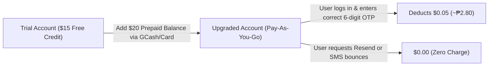
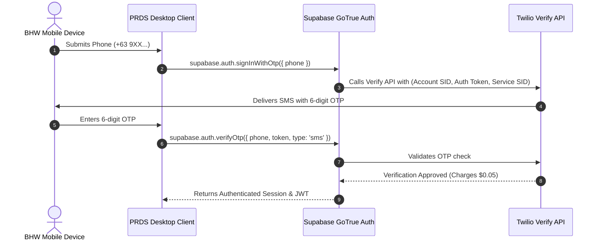

# Twilio Verify Architecture & Integration Guidelines

**Project:** Pharmaceutical Resources Distribution System (PRDS)  
**Target Scope:** City Health Office (CHO) of Naga, Cebu & 28 Barangay Health Stations (BHWs)  
**Integration Type:** Supabase Auth + Twilio Verify API  
**Document Status:** Technical Guidelines & Setup Reference  
**File Location:** `documentation/1-Planning/Twilio Guidelines.md`  

---

## 1. Executive Summary & Why Twilio Verify

For PRDS user registration and login verification, **Twilio Verify** is selected over standard programmable SMS and local gateways for three primary reasons:

1. **Native Supabase Integration:** Supabase has a built-in Twilio Verify provider in the dashboard—requiring **zero backend/Edge Function code**.
2. **"Pay-on-Success" Billing:** Unlike standard SMS gateways that charge for every attempt, Twilio Verify **only charges when an OTP is successfully confirmed** (~$0.05 / ~₱2.80). Resends and failed deliveries cost **$0.00**.
3. **No Telco Paperwork Delays:** Bypasses the 2-week school endorsement letter and DITO Letter of Authorization (LOA) requirements enforced by local Philippine aggregators under the SIM Registration Act.

---

## 2. Subscription, Pricing & Billing Model

Twilio operates on a transparent, prepaid **Pay-As-You-Go** model. There is **no recurring monthly contract** or monthly maintenance fee.

### 2.1 Pricing Breakdown
* **Monthly Fee:** **$0.00 / month** (You only pay when users verify).
* **Cost per Successful Login:** **$0.05 USD** (~₱2.80 PHP).
* **Cost for Resend / Bounced / Unverified SMS:** **$0.00 USD** (Completely free).
* **Credits Expiry:** Twilio prepaid funds do not expire as long as the account remains active.

### 2.2 Payment Method (GCash & Maya Friendly)
* To upgrade from Trial to Paid, Twilio requires an initial balance top-up (minimum is typically **$20.00 USD**, approx. ₱1,120 PHP).
* **Accepted Philippine Payment Methods:**
  * **GCash Visa Card** (virtual or physical card linked to your GCash wallet balance).
  * **Maya Card** (virtual Visa/Mastercard inside the Maya app).
  * Local bank debit/credit cards (BPI, BDO, UnionBank).

### 2.3 Cost Protection (Disabling Auto-Recharge)
To avoid unintended recurring card charges:
1. Go to **Billing ➔ Payment Preferences** in Twilio Console.
2. Toggle **Auto-Recharge** to **OFF**.
3. *Result:* Twilio will never automatically deduct funds from your bank/GCash card. You manually decide when to load credits.

---

## 3. Step-by-Step Twilio Console Configuration

All configuration should be done inside your dedicated **`PRDS`** Twilio account (`AC[YOUR_TWILIO_ACCOUNT_SID]`).

### Step 1: Copy Account Credentials
1. Open the [Twilio Console](https://console.twilio.com).
2. On the main Dashboard, look at the **Account Info** tile:
   * 📋 Copy **Account SID** (Format: `ACxxxxxxxxxxxxxxxxxxxxxxxxxxxxxxxx`).
   * 📋 Copy **Auth Token** (Click "Show" and copy).

### Step 2: Create a Twilio Verify Service
1. In the left navigation search bar, type **Verify** (or navigate to **Explore Products ➔ Verify ➔ Services**).
2. Click **Create Service**.
3. **Friendly Name:** Enter `PRDS Auth` (or `Naga City CHO`).
4. **Code Length:** Keep the default `6 digits`.
5. Click **Create**.
6. Once created, look at the top of the service page:
   * 📋 Copy the **Service SID** (Format: `VAxxxxxxxxxxxxxxxxxxxxxxxxxxxxxxxx`).

### Step 3: Configure Geo-Permissions (Crucial Security Step)
To prevent international bot fraud and protect your balance:
1. In the left navigation, search for **Geo-Permissions** (under Messaging Settings).
2. Ensure **Philippines (+63)** is checked/enabled.
3. Uncheck countries where you do not have staff (e.g., high-risk international prefixes) so only Philippine mobile numbers can trigger SMS.

---

## 4. Supabase Dashboard Integration

Once you have your three Twilio credentials (`AC...`, `Auth Token`, `VA...`), configure Supabase:

### Steps in Supabase:
1. Open your **Supabase Dashboard** ➔ Select your PRDS project.
2. Go to **Authentication** ➔ **Providers** ➔ **Phone**.
3. Toggle **Enable Phone provider** to **ON** (green).
4. In the **SMS provider** dropdown, select **`Twilio Verify`** *(Option #5 in dropdown)*.
5. Fill in the fields:
   * **Twilio Account SID:** Paste `AC...`
   * **Twilio Auth Token:** Paste Auth Token
   * **Twilio Verify Service SID:** Paste `VA...`
6. Set the parameters:
   * **SMS OTP Expiry:** `180` seconds (3 minutes).
   * **Enable phone confirmations:** `ON`.
7. Click **Save Changes** at the bottom right.

---

## 5. Trial Mode Rules vs. Upgraded Production Mode

| Capability | Trial Account (Free $15) | Upgraded Account ($20 Prepaid) |
| :--- | :--- | :--- |
| **Recipient Phone Numbers** | **Verified numbers only** (Must pre-register numbers in Console) | **Any Philippine mobile number** (`+639...`) |
| **BHW Usability** | Only test group (e.g., developers, adviser) | All 28 Barangay Health Stations |
| **SMS Header** | Prepends `"Sent from your Twilio trial account -"` | Clean verification code message |
| **Initial Cost** | **$0.00** | **$20.00 deposit** (deducted per login) |

### How to Test in Trial Mode Right Now:
Before upgrading, you can test for free by adding your personal number:
1. In Twilio Console, go to **Phone Numbers ➔ Manage ➔ Verified Caller IDs**.
2. Click **Add a new Caller ID**.
3. Enter your personal Philippine number (`+63 9xx...`) and verify via call/SMS.
4. You can now test the full PRDS login flow to your phone without paying!

---

## 6. Security, Rate Limiting & User Lifecycle

1. **Frontend Cooldown Timer:**
   * Enforce a strict **60-second countdown** on the PRDS Desktop UI before allowing the user to click "Resend OTP".
2. **Database Profile Synchronization:**
   * Review [SMS supabase setup.md](file:///d:/prds/documentation/1-Planning/SMS%20supabase%20setup.md) to ensure the database trigger `handle_new_auth_user_profile()` supports `new.phone` so authenticated users are saved in `public.profiles`.
3. **Role Gating:**
   * Newly verified phone accounts start in `status: 'PENDING'` until approved by a `PHARMA_II` (Admin).

---

## 7. Troubleshooting & FAQs

* **Error: `Twilio Error 20003 - Authentication Error`**
  * *Cause:* Account SID or Auth Token was copied with leading/trailing spaces.
  * *Fix:* Re-copy directly from the Twilio Console and update Supabase.
* **Error: `Twilio Error 60200 - Invalid Parameter / Phone Number`**
  * *Cause:* Phone number not formatted in E.164 international format.
  * *Fix:* Ensure the frontend formats input as `+639XXXXXXXXX`.
* **SMS Not Arriving in Trial Mode:**
  * *Cause:* In trial mode, SMS can only be sent to numbers listed under **Verified Caller IDs**.
  * *Fix:* Add the recipient's phone number to Verified Caller IDs, or upgrade the account.
