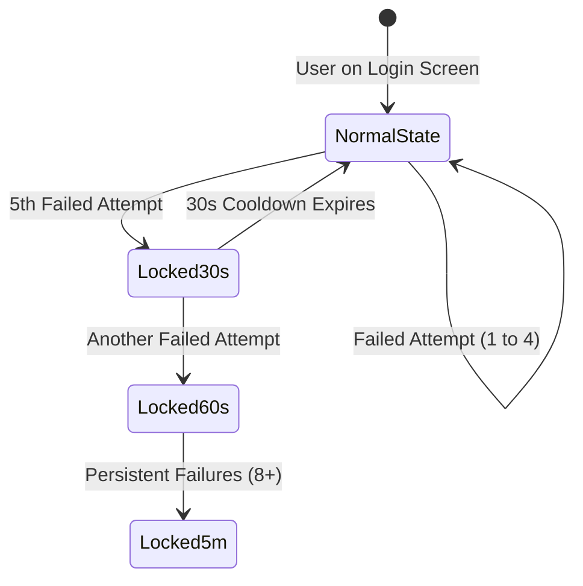

# PRDS Input Validation, Rate Limiting, and Security Guidelines

**Project:** Pharmaceutical Resources Distribution System (PRDS)  
**Target Scope:** City Health Office (CHO) of Naga, Cebu & 28 Barangay Health Stations (BHWs)  
**Document Status:** Technical Specification & Quality Standard  
**File Location:** `documentation/3-Application/PRDS Input Validation and Security Guidelines.md`  

---

## 1. Overview & Purpose

This document establishes the official validation rules, rate-limiting policies, character sanitization standards, and user experience patterns across all input forms in PRDS Desktop and Web clients.

The goal is to maintain high data integrity in clinical records, protect healthcare workers from accidental data entry errors, and shield the authentication layer against brute-force attacks and credit depletion.

---

## 2. Authentication & Account Registration Standards

### 2.1 Philippine Mobile Number Normalization
Mobile numbers submitted during registration or login must support the three common Philippine user input styles without throwing validation errors.

* **Accepted Input Styles:**
  * Local standard: `0917 123 4567` or `09171234567`
  * International prefixed: `+63 917 123 4567` or `+639171234567`
  * National prefix without plus: `639171234567`
* **Internal Normalization Logic:**
  ```javascript
  export const normalizePhilippinePhone = (input) => {
    let cleaned = String(input || "").replace(/\D/g, "");
    if (cleaned.startsWith("639") && cleaned.length === 12) {
      cleaned = "0" + cleaned.slice(2); // Normalizes to 09XXXXXXXXX
    }
    return cleaned;
  };

  export const toE164Phone = (input) => {
    const local = normalizePhilippinePhone(input);
    return local.startsWith("09") ? "+63" + local.slice(1) : local;
  };
  ```
* **Rejection Criteria:**
  * Landline numbers or numbers not starting with mobile prefix `09` (or `+639`).
  * Total digit count other than 11 digits (local) or 12 digits (with country code `63`).

---

### 2.2 Password Complexity & Live Strength Meter
To prevent weak or predictable passwords on shared health center computers, passwords must meet clinical security standards:

* **Length Requirement:** Minimum **12 characters** (`MIN_PASSWORD_LENGTH = 12`).
* **Complexity Requirements:**
  1. At least one uppercase letter (`[A-Z]`)
  2. At least one lowercase letter (`[a-z]`)
  3. At least one numeric digit (`[0-9]`)
  4. At least one special symbol (`[!@#$%^&*()_+\-=[\]{};':"\\|,.<>/?]`)
* **Live Visual Feedback:**
  * Forms should render an interactive strength meter bar:
    * 🔴 **Weak:** Below 12 characters or missing complexity elements.
    * 🟡 **Fair:** 12+ characters with letters and numbers.
    * 🟢 **Strong:** 12+ characters meeting all four complexity criteria.

---

### 2.3 Cultural Name Sanitization & XSS Defense
Forms capturing patient and staff names must accommodate Filipino naming conventions while stripping dangerous code injections:

* **Supported Characters:**
  * Spanish/Filipino alphabetic letters: `ñ`, `Ñ`, accented vowels (`á`, `é`, `í`, `ó`, `ú`).
  * Punctuation in surnames: Apostrophes (e.g., `D'Angelo`, `O'Connor`) and hyphens (e.g., `Mary-Ann`, `Dela-Cruz`).
* **Standardized Suffixes:**
  * Dropdown selector or sanitized input restricted to: `None`, `Jr.`, `Sr.`, `II`, `III`, `IV`.
* **Sanitization Rule (XSS Protection):**
  * Strip angle brackets (`<`, `>`), script tags, and unescaped SQL characters before dispatching to Supabase or writing to local SQLite.

---

## 3. Rate Limiting & Brute-Force Defenses



### 3.1 Progressive Login Lockout
To protect accounts against automated dictionary attacks and avoid tripping global IP rate limits on Supabase:

* **Attempts 1–4:** Display standard error: *"Invalid email, phone number, or password."*
* **Attempt 5:** Trigger a **30-second client-side lockout**. Disable the "Sign In" button and show a visible countdown timer.
* **Attempt 6–7:** Escalate lockout to **60 seconds**.
* **Attempt 8+:** Lock login for **5 minutes** and prompt the user to use "Forgot Password".

---

### 3.2 SMS OTP Verification Throttling
To protect project SMS balance and prevent denial-of-service on user devices:

* **Resend Countdown Timer:**
  * When an OTP is dispatched, the "Resend Code" button enters a mandatory **60-second cooldown**.
  * The button displays: `Resend Code in (59s)...` and remains unclickable until the timer reaches zero.
* **Maximum OTP Validation Attempts:**
  * A single OTP code is permitted a maximum of **3 incorrect submission attempts**.
  * On the 3rd failed attempt, the code is invalidated, and the user must request a fresh OTP.

---

## 4. Clinical, Patient, and Inventory Domain Validations

### 4.1 Patient Record Integrity
Aligned with `database/schema/patient_schema.sql`:

| Field | Column | Validation Rule |
|---|---|---|
| **Patient Code** | `patient_code` | Required. Must match assigned format pattern (e.g., `PAT-YYYY-XXXXX`); must be unique per facility. |
| **First & Last Name** | `first_name`, `last_name` | Required. 2–50 characters, trimmed. Must support `ñ`, `Ñ`, hyphens, and apostrophes. |
| **Middle Name** | `middle_name` | Optional. Allows single-letter middle initials or full middle names. |
| **Date of Birth** | `date_of_birth` | Required. Must be a valid date; cannot be in the future; cannot be older than 120 years. |
| **Gender** | `gender` | Required. Enum selection: `MALE` or `FEMALE`. |
| **Contact Number** | `contact_number` | Optional. If provided, must validate to an 11-digit Philippine mobile number. |
| **Barangay Facility** | `facility_id` | Required. Must reference an active facility UUID in `facilities`. |

---

### 4.2 Medicine Dispensing & FEFO Safety Rules
Aligned with `database/schema/medicine_dispensing_schema.sql` and `src/shared/utils/dispensingUtils.js`:

* **Dispensing Quantity Clamping:**
  * Must be an integer strictly greater than zero (`quantity > 0`).
  * Decimal quantities are disallowed unless explicitly supported by the unit of measure (e.g., fractional bottles/syrups).
  * Quantity must not exceed the remaining physical count of the selected inventory batch (`quantity <= batch.quantity`).
* **FEFO Expiration Lockout:**
  * The system must strictly reject dispensing any batch where `expiration_date <= CURRENT_DATE`.
  * Expired batches are visibly flagged with a red alert badge (`EXPIRED`) and disabled from selection.
* **Prescriber Field:**
  * The `prescribed_by` field must be non-empty (identifying the attending physician, nurse, or midwife).

---

### 4.3 Inventory & Stock Transfer Validations
* **Unit Cost Validation:**
  * Currency values (`unit_cost`) must be numerical decimals `>= 0.00`. Negative costs are strictly rejected.
* **Batch Number Formatting:**
  * Required alphanumeric string. Spaces and symbols are sanitized to prevent duplicate batch fragmentation.
* **Transfer Allocations:**
  * Stock transfer orders cannot exceed available source facility inventory. Source and destination facilities must be distinct (`source_facility_id <> destination_facility_id`).

---

## 5. Profile Picture (Avatar) Storage, Compression & Rate Limiting

To preserve the **Supabase Free Tier storage (1 GB quota)** and **egress bandwidth (2 GB/month)**, strict limits and client-side processing apply to staff profile picture uploads in the Profile module.

### 5.1 Storage & File Size Constraints
* **Upload Size Limit:** Maximum **2 MB** (`MAX_AVATAR_SIZE = 2 * 1024 * 1024`). Files exceeding 2 MB are rejected immediately on selection with helper text: *"Image file must be 2 MB or smaller."*
* **Allowed MIME Formats:** `image/jpeg`, `image/png`, `image/webp`.
* **Disallowed & High-Risk Types:**
  * **Strict SVG Rejection:** `.svg` files are strictly rejected. SVGs can embed arbitrary XML/JavaScript code, presenting a severe Stored XSS vulnerability.
  * Disallowed: `.gif`, `.bmp`, `.pdf`, `.exe`.
* **Supabase Bucket Security:**
  * Bucket name: `avatars` (Public read, authenticated insert/update).
  * Bucket constraint: `file_size_limit: 2097152` (2 MB) enforced at the storage API level.

### 5.2 Client-Side Auto-Compression (Canvas Pre-processing)
Health staff taking photos via high-resolution smartphones produce 5 MB–15 MB files. Storing raw photos would exhaust the 1 GB bucket with fewer than 100 uploads.

* **Client Downscaling Workflow:**
  1. Read selected image file via `FileReader`.
  2. Load into an off-screen HTML5 `<canvas>`.
  3. Crop and resize to maximum **400 × 400 pixels** (1:1 square aspect ratio).
  4. Export canvas to `image/webp` (or `image/jpeg` fallback) at **0.80 (80%) quality**.
  5. Upload the resulting Blob.
* **Storage Impact:** Downscaling shrinks the stored image to **30 KB – 80 KB** (a ~98% reduction), enabling 100 staff members to occupy less than **8 MB total storage** (< 0.8% of free tier).

### 5.3 Deterministic File Path & Orphan Prevention
To avoid accumulating unlinked, orphaned historical avatar files in the storage bucket:
* **Deterministic Storage Path:** Every user's photo is stored at a fixed path using their Auth UID:
  ```text
  avatars/{user_id}/avatar.webp
  ```
* **Upsert Enforced:**
  ```javascript
  const { data, error } = await supabase.storage
    .from('avatars')
    .upload(`${userId}/avatar.webp`, compressedBlob, {
      contentType: 'image/webp',
      cacheControl: '3600',
      upsert: true // Replaces existing file; zero storage leakage
    });
  ```

### 5.4 Once-a-Week (7-Day) Update Rate Limiting
To prevent abuse, spamming storage API endpoints, and unnecessary egress consumption, profile picture updates are throttled to **once every 7 days**.

* **Database Column:** `public.profiles.avatar_updated_at TIMESTAMPTZ DEFAULT NULL`.
* **Cooldown Rule:**
  * If `avatar_updated_at` is `NULL`, the user may upload an avatar immediately.
  * If `avatar_updated_at` is set, check: `CURRENT_TIMESTAMP - avatar_updated_at >= INTERVAL '7 days'`.
  * If less than 7 days have elapsed, the update is blocked.
* **UI/UX Display States:**
  * **Cooldown Active:**
    * Camera/Upload button shows disabled state with a lock icon 🔒.
    * Tooltip / Banner displays: *"Profile picture can only be changed once a week. Next update available on [Month Day, Year] ([X] days remaining)."*
  * **Eligible State:**
    * Upload button is active with helper note: *"Max 2 MB (JPG, PNG, WebP). Allowed once every 7 days."*

---

## 6. User Interface Validation Patterns (UX Standards)

1. **Inline Field Validation (Debounced / On Blur):**
   * Fields should validate as soon as the user finishes typing (300ms debounce) or moves focus to the next field (`onBlur`).
   * Valid fields display a subtle green checkmark `✓`.
   * Invalid fields display clear, specific red helper text directly beneath the field (e.g., *"Phone number must start with 09 and have 11 digits"*).
2. **Accessible Error Messaging:**
   * Error messages must describe **how to fix the problem**, rather than displaying vague messages like *"Invalid input"*.
   * Error containers must utilize `aria-live="polite"` and `role="alert"` for screen readers.
3. **Disabled Submit Button State:**
   * Submit and Register buttons should remain visually disabled (`opacity-50 cursor-not-allowed`) until all mandatory fields pass client-side validation, preventing wasted network roundtrips.

---

## 7. Implementation References

* **Auth Validation Helpers:** [`src/shared/utils/authRegistrationUtils.js`](file:///d:/prds/prds-desktop/src/shared/utils/authRegistrationUtils.js)
* **Dispensing Validation Helpers:** [`src/shared/utils/dispensingUtils.js`](file:///d:/prds/prds-desktop/src/shared/utils/dispensingUtils.js)
* **Patient Management Helpers:** [`src/shared/utils/patientUtils.js`](file:///d:/prds/prds-desktop/src/shared/utils/patientUtils.js)
* **Profile Management View:** [`src/frontend/views/profile/ProfilePage.jsx`](file:///d:/prds/prds-desktop/src/frontend/views/profile/ProfilePage.jsx)
* **Registration View:** [`src/frontend/views/auth/RegisterPage.jsx`](file:///d:/prds/prds-desktop/src/frontend/views/auth/RegisterPage.jsx)
* **Login View:** [`src/frontend/views/auth/LoginPage.jsx`](file:///d:/prds/prds-desktop/src/frontend/views/auth/LoginPage.jsx)
* **OTP Modal View:** [`src/frontend/views/auth/OTPVerification.jsx`](file:///d:/prds/prds-desktop/src/frontend/views/auth/OTPVerification.jsx)
