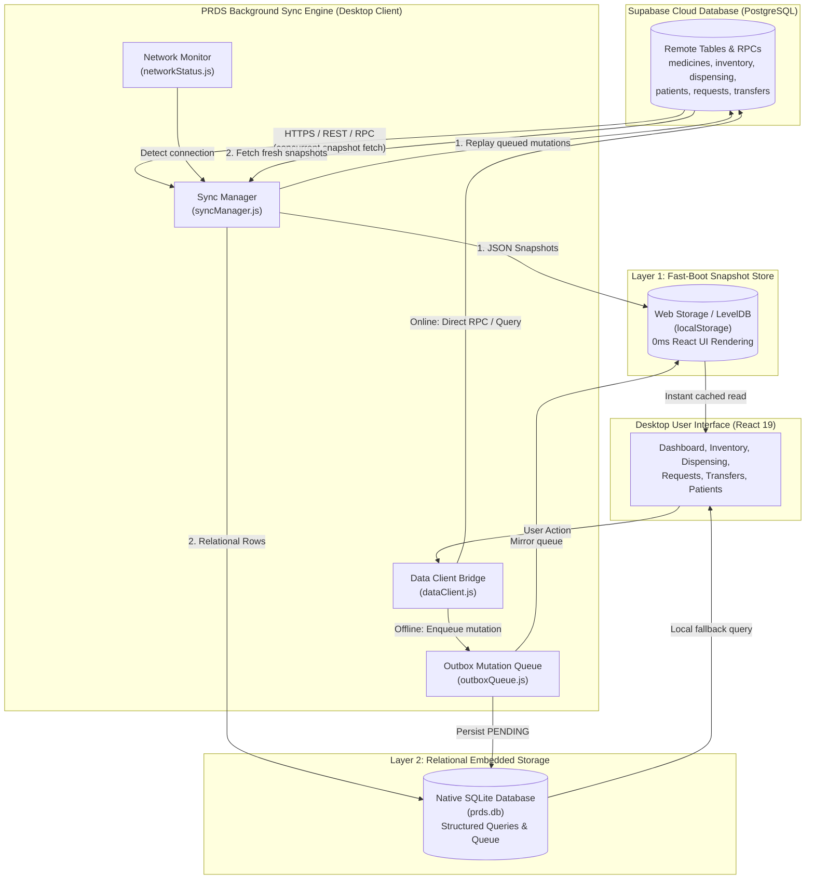
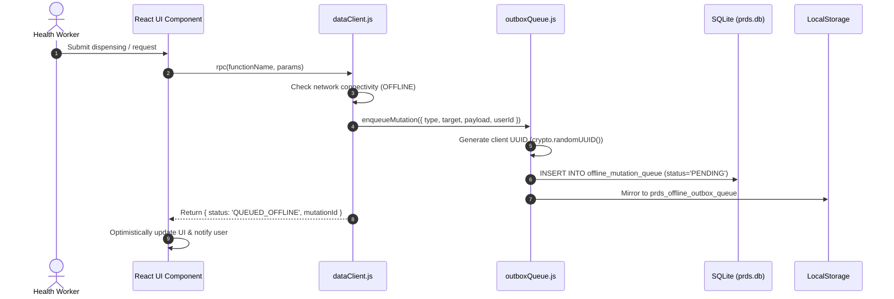
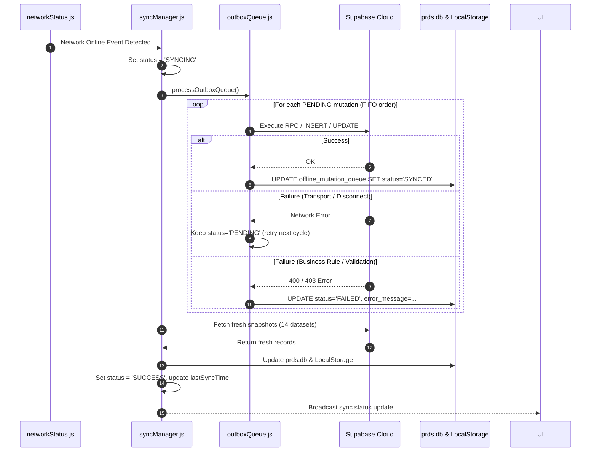
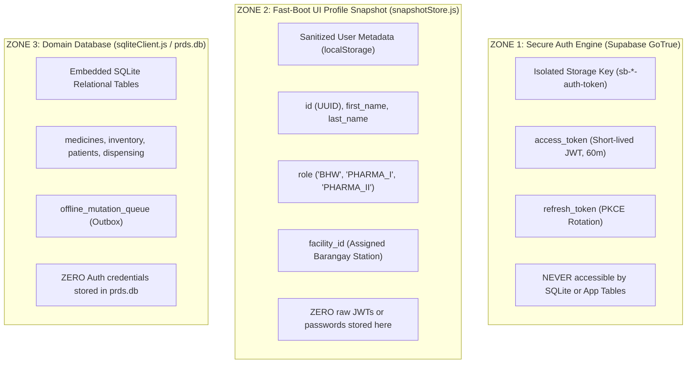

# PRDS Offline and Online Sync Architecture

This document provides the technical architectural reference for how data flows between the cloud database (Supabase) and the desktop client (`prds-desktop`), how data is structured and stored locally, the exact physical storage paths on disk, and how offline operations are reconciled.

---

## 1. High-Level Architectural Overview

PRDS implements an **Offline-First Architecture (specifically: Cloud-Authoritative Outbox Pattern with Local Embedded Replication)** rather than a pure Local-First model:
* **The Cloud (Supabase PostgreSQL)** is the authoritative single source of truth for global healthcare compliance, audit logs, and central stock ledgers.
* **The Desktop Client (`prds-desktop`)** runs with an **embedded local database replica** and an outbox queue to guarantee that health workers in rural, disconnected barangays can perform continuous walk-in dispensing, record lookups, and patient searches with zero internet dependence.
* **Storage Terminology Distinction:**
  * **Persistent Local Replica (`prds.db` / SQLite):** A true embedded relational database on disk used for structured querying and mutation queueing. It is *not* merely a cache.
  * **In-Memory View Cache (`snapshotStore.js` / LocalStorage):** An ephemeral JSON view cache designed strictly for 0ms React UI mounting, chart hydration, and instant rendering.



---

## 2. Exact Local Storage Locations on Disk (Windows)

All data fetched from the cloud database is persisted locally on the user's computer across two distinct locations:

### A. Primary Relational Database (`prds.db`)
The desktop client uses native SQLite via Tauri's `@tauri-apps/plugin-sql`. The database is created automatically upon first run under the application's assigned identifier `com.prds.naga`.

* **Exact Absolute Path:**
  ```text
  C:\Users\<Username>\AppData\Roaming\com.prds.naga\prds.db
  ```
* **Quick Access Shortcut (Windows Run / Explorer):**
  ```text
  %APPDATA%\com.prds.naga
  ```
* **Files Located in that Folder:**
  | File Name | Purpose | Description |
  |---|---|---|
  | **`prds.db`** | Main Database | Contains all relational tables, cached entities, and offline mutation queues. |
  | **`prds.db-wal`** | Write-Ahead Log | High-performance SQLite journal file used for concurrent reads/writes. |
  | **`prds.db-shm`** | Shared Memory Index | Index file coordinating shared access between Tauri Rust threads and SQLite. |

> [!TIP]
> You can open `prds.db` with **DB Browser for SQLite** or the VS Code SQLite Viewer extension to browse, inspect, and run SQL queries against the local desktop data.

---

### B. Fast-Boot Snapshot Store (WebView2 LocalStorage LevelDB)
The desktop application's embedded Microsoft Edge WebView2 engine stores the JSON snapshots (`prds_snapshot_*`) in a persistent Chromium LevelDB directory:

* **Exact Absolute Path:**
  ```text
  C:\Users\<Username>\AppData\Local\com.prds.naga\EBWebView\Default\Local Storage\leveldb\
  ```
* **Quick Access Shortcut:**
  ```text
  %LOCALAPPDATA%\com.prds.naga\EBWebView\Default\Local Storage\leveldb
  ```

*(Note: During development when running `npm run dev` in an external browser, this storage is located in the browser's own standard Local Storage origin `http://localhost:5173`.)*

---

## 3. Data Ingestion Architecture (Cloud → Local)

The process of fetching remote data and storing it locally is orchestrated by `src/backend/sync/syncManager.js`.

### Trigger Conditions
Synchronization occurs automatically under any of the following conditions:
1. **Initial User Sign-In**: Automatically runs upon session establishment.
2. **Network Reconnection**: When `networkStatus.js` detects internet restoration (debounced by 1.2s to ensure socket stability).
3. **Periodic Auto-Sync**: Runs in the background every few minutes if network is active and pending local mutations exist.
4. **Manual User Refresh**: When a user clicks the **Sync** button in the application status bar or dashboard.

### Fetch & Cache Pipeline
When `syncAllData()` executes:
1. **Session Lock Verification**: Validates that an active `syncUserId` exists and binds the operation to a snapshot revision counter (`syncRevision`).
2. **Chunked & Paginated Fetching**: Uses `Promise.all` with individual timeout guards (7,000ms for standard entities; 60,000ms for large paginated datasets) across **14 distinct sources**. For heavy relational tables (`dispensing`, `requests`, `transfers`, `activity_logs`, `forecasting`), chunks are bounded to **250 rows per page** (via `syncUtils.fetchAllRows`) to eliminate client memory spikes and prevent payload timeout drops on rural mobile connections:
   - `medicines`: Generic name, brand name, dosage, unit cost, categories.
   - `inventory`: Batches, quantities, threshold alerts, FEFO expiration dates.
   - `facilities` & `suppliers`: Addresses, codes, status, coordinates.
   - `patients`: Patient demographics, PhilHealth IDs, facility assignments.
   - `medicine_dispensing`: Walk-in and referral dispensing transactions with nested patient and batch relations.
   - `medicine_requests`: Replenishment orders and fulfillment batch allocations.
   - `stock_transfers`: Inter-facility transfers and allocations.
   - `forecasting`: Monthly demand forecasts generated by analytics.
   - `monthly_dispensing_summary`: Pre-aggregated monthly dispensing trends.
   - `other_programs`: Special health programs and allocated medicines.
   - `profiles`: All user profiles and facility assignments.
   - `activity_logs`: Audit trail logs and actor details.
   - `notifications`: User notifications retrieved via `get_visible_notifications`.
3. **Layer 1 Persistence (`snapshotStore.js`)**:
   - Data is serialized to JSON and stored into `localStorage` keys for instant 0ms app boot and React component mounting:
     - `prds_snapshot_medicines`
     - `prds_snapshot_inventory`
     - `prds_snapshot_facilities`
     - `prds_snapshot_suppliers`
     - `prds_snapshot_patients`
     - `prds_snapshot_requests`
     - `prds_snapshot_transfers`
     - `prds_snapshot_dispensing`
     - `prds_snapshot_dispensing_summary`
     - `prds_snapshot_forecasting`
     - `prds_snapshot_other_programs`
     - `prds_snapshot_users`
     - `prds_snapshot_activity_logs`
     - `prds_snapshot_notifications`
4. **Layer 2 Persistence (`sqliteClient.js`)**:
   - When running in Tauri, data is mapped directly into **14 relational SQLite mirror tables** in `prds.db` using serialized execution, ensuring exact cloud parity without connection pool transaction contention.

---

## 4. Local SQLite Database Schema (`prds.db`)

The native SQLite schema initialized by `sqliteClient.js` contains 14 fully-mirrored application tables plus synchronization metadata and queue tables:

| Table Name | Key Columns | Description |
|---|---|---|
| `medicines` | `id`, `generic_name`, `brand_name`, `dosage`, `unit_cost`, `categories_json`, `data_json` | Cached medicine catalog with full JSON payload. |
| `inventory` | `id`, `facility_id`, `medicine_id`, `quantity`, `threshold`, `batch_number`, `expiration_date` | Stock levels, batch numbers, and FEFO expiry data. |
| `facilities` | `id`, `facility_name`, `facility_code`, `facility_type`, `status`, `data_json` | City Health Office and all Barangay Health Stations. |
| `suppliers` | `id`, `supplier_name`, `status`, `data_json` | Medicine distributors and contact details. |
| `patients` | `id`, `facility_id`, `first_name`, `last_name`, `philhealth_id`, `data_json` | Patient demographic records and profiles. |
| `dispensing_records` | `id`, `facility_id`, `patient_id`, `dispensed_by`, `data_json`, `is_synced` | Walk-in dispensing transactions. |
| `requests` | `id`, `request_number`, `facility_id`, `status`, `data_json`, `is_synced` | BHW medicine replenishment requests. |
| `transfers` | `id`, `transfer_number`, `source_facility_id`, `target_facility_id`, `status`, `is_synced` | Inter-facility transfer orders. |
| `monthly_dispensing_summary` | `facility_id`, `medicine_id`, `month`, `total_dispensed` | Aggregated dispensing metrics used for forecasting. |
| `other_programs` | `id`, `program_name`, `program_date`, `description`, `data_json` | Special public health program allocations. |
| `forecasting` | `id`, `facility_id`, `forecast_month`, `predicted_quantity`, `data_json` | Predictive monthly medicine demand quantities. |
| `profiles` | `id`, `first_name`, `last_name`, `email`, `phone_number`, `role`, `facility_id`, `status` | User accounts and role-based permissions. |
| `activity_logs` | `id`, `user_id`, `action`, `module`, `details`, `created_at`, `data_json` | System audit trail records. |
| `notifications` | `id`, `user_id`, `title`, `message`, `is_read`, `created_at`, `data_json` | Push and system notifications. |
| `sync_metadata` | `key`, `value`, `updated_at` | Catalog schema versions, sync timestamps, and audit flags. |
| `offline_mutation_queue` | `id`, `user_id`, `facility_id`, `mutation_type`, `target`, `payload_json`, `status` | Outbox table storing actions performed while disconnected. |

### SQLite Performance Indices
To maximize query responsiveness on client machines with large historical records, the schema maintains indices on high-cardinality foreign keys and lookup filters:
* `idx_inventory_facility` (`inventory.facility_id`)
* `idx_inventory_medicine` (`inventory.medicine_id`)
* `idx_patients_facility` (`patients.facility_id`)
* `idx_dispensing_facility` (`dispensing_records.facility_id`)
* `idx_dispensing_patient` (`dispensing_records.patient_id`)
* `idx_requests_facility` (`requests.facility_id`)
* `idx_transfers_source` (`transfers.source_facility_id`)
* `idx_transfers_target` (`transfers.target_facility_id`)
* `idx_activity_logs_user` (`activity_logs.user_id`)
* `idx_notifications_user` (`notifications.user_id`)

### Dual-Persistence on Mutation (`dataClient.upsertLocalRecord`)
Whenever new records are created or pushed (e.g. during walk-in dispensing, medicine request creation, or patient registration), `dataClient.upsertLocalRecord(table, record)` performs **dual-persistence**:
1. Immediately writes or updates the corresponding row in local SQLite (`prds.db`).
2. Optimistically updates the fast-boot snapshot array in `localStorage`.
3. Dispatches the cloud push to Supabase (if online) or queues the action in `offline_mutation_queue` (if offline).

This guarantees that the local cache is always a real-time mirror of client state, ensuring instant reads without cloud roundtrip delays.

---

## 5. Offline Write & Outbox Pipeline (Local UI → Outbox)

When a user performs an action while disconnected (such as dispensing medicine, adding a patient, or creating a stock request):



### Key Principles of Offline Writes:
1. **Client-Side UUIDs**: Primary keys are generated on the client via `crypto.randomUUID()` so that local relations and batch allocations maintain foreign-key integrity before ever reaching Supabase.
2. **Supported Mutation Types**:
   - `RPC`: Remote procedure calls (e.g. `dispense_walk_in`, `submit_bhw_medicine_request`).
   - `INSERT`: Standard record creation.
   - `UPDATE`: Entity modification.
   - `DELETE`: Entity deletion.
3. **Optimistic Feedback**: The UI immediately reflects changes without waiting for server confirmation.
4. **Owner-Scoped Security**: Mutations in the outbox are tagged with `user_id`. Only the authenticated owner can replay their pending changes.

---

## 6. Reconnection & Outbox Drain Pipeline (Outbox → Supabase)

When connectivity is restored, the sync engine drains the queue before pulling fresh snapshots:



---

## 7. Three-Zone Storage & Session Separation

PRDS implements a strict **Separation of Concerns and Security Boundaries** across three isolated data zones:



### 7.1 Separation Rationale & Architectural Guarantees

| Data Zone | Content | Lifecycle | Security Boundary |
|---|---|---|---|
| **Zone 1: Auth Tokens** | Cryptographic session tokens (`access_token`, `refresh_token`). | Dynamic, short-lived (auto-refreshed via PKCE flow every hour). | Isolated by the Supabase Client SDK. Never written to SQLite or readable by general domain queries. |
| **Zone 2: User Profile Snapshot** | Sanitized user display info and role permissions. | Session-scoped. Revalidated in the background when online. | Enables instantaneous **0ms desktop boot** without requiring network ping before mounting the React shell. |
| **Zone 3: SQLite Replica** | Healthcare inventory, patients, batches, and offline mutations. | Long-lived, persistent on disk (`prds.db`). | Contains **zero credentials**. If the local database file is inspected with DB Browser, no auth secrets exist. |

### 7.2 Key Operational Advantages of this Separation

1. **Local Database Cleanup Does Not Log Users Out:**
   - If local data needs to be cleared or reset due to corrupted schema versions, the local SQLite database or snapshot cache can be purged safely.
   - Because the session tokens reside in Zone 1, **the user remains securely logged in**, and the application automatically downloads clean snapshots on the next sync.
2. **Account Switching & Data Leak Isolation (`isCurrentSession`):**
   - The sync manager binds each sync pass to a session revision counter (`syncRevision`).
   - If User A logs out and User B logs in while a cloud download is in-flight, `isCurrentSession()` aborts the write, preventing data from bleeding between different user accounts on shared barangay laptops.
3. **Graceful Offline Boot (`AuthProvider.jsx`):**
   - On boot, `AuthProvider` reads Zone 2 immediately (`getCachedUserSession()`), providing instant UI state.
   - It then performs a background race check (`Promise.race([supabaseAuth.auth.getSession(), timeout])`) with a 1.5s timeout. If offline, it smoothly keeps the cached profile active without showing a blocking login spinner.

---

## 8. Session Lifecycle & Data Retention

| Action | Local Session & Snapshot State | Outbox Mutation Queue |
|---|---|---|
| **Network Loss** | Session and snapshots remain fully accessible for offline viewing and supported writes. | Pending mutations remain safely preserved in `prds.db` and `localStorage`. |
| **Network Restored** | Queued mutations are drained and authoritative snapshots are re-downloaded. | Synced records are completed; failed records show an error badge for review. |
| **User Sign-Out** | Volatile session snapshots (`prds_snapshot_*`) and tokens are cleared from memory and storage. | **Preserved on device**, securely scoped to the original `user_id` so unsynced field work is never lost. |
| **Exit App (Remember Session)** | Session, tokens, and snapshots are kept intact for instant 0ms startup on next launch. | Preserved. |
| **Exit App (Do Not Remember)** | Session and volatile snapshots are cleared before the desktop window closes. | Preserved for the authenticated owner. |

---

## 9. Source Code References

* **Background Sync Manager**: [`prds-desktop/src/backend/sync/syncManager.js`](file:///d:/prds/prds-desktop/src/backend/sync/syncManager.js)
* **Outbox Queue Engine**: [`prds-desktop/src/backend/sync/outboxQueue.js`](file:///d:/prds/prds-desktop/src/backend/sync/outboxQueue.js)
* **Network Status Monitor**: [`prds-desktop/src/backend/sync/networkStatus.js`](file:///d:/prds/prds-desktop/src/backend/sync/networkStatus.js)
* **Unified Data Client**: [`prds-desktop/src/backend/client/dataClient.js`](file:///d:/prds/prds-desktop/src/backend/client/dataClient.js)
* **Snapshot Store**: [`prds-desktop/src/backend/database/snapshotStore.js`](file:///d:/prds/prds-desktop/src/backend/database/snapshotStore.js)
* **Native SQLite Client**: [`prds-desktop/src/backend/database/sqliteClient.js`](file:///d:/prds/prds-desktop/src/backend/database/sqliteClient.js)
* **Tauri Configuration**: [`prds-desktop/src-tauri/tauri.conf.json`](file:///d:/prds/prds-desktop/src-tauri/tauri.conf.json)
