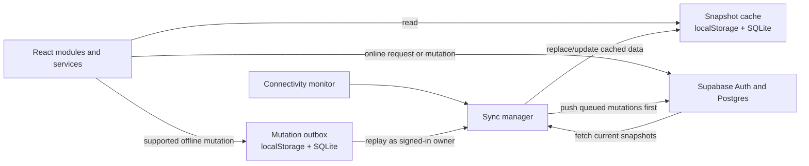
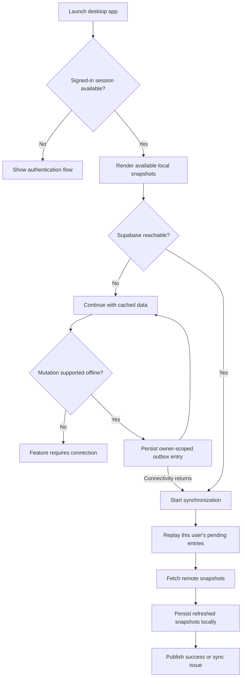

# PRDS Offline and Online Sync Framework

## Purpose and Scope

This document describes how the maintained desktop application (`prds-desktop`) caches remote data, accepts selected offline changes, and reconciles them with Supabase when connectivity returns. Supabase is the authoritative shared database. Local snapshots support viewing; the mutation outbox holds pending writes. They have different lifecycles and must not be treated as interchangeable.

The implementation is selectively offline-capable. It does not currently guarantee that every module can create or change data while disconnected.

## Architecture

### Main Components

| Component | Responsibility |
|---|---|
| `src/backend/database/snapshotStore.js` | Stores cached user/profile and feature snapshots in `localStorage`; clears session snapshots on logout. |
| `src/backend/database/sqliteClient.js` | Initializes the native SQLite schema and local snapshot/outbox tables in Tauri. |
| `src/backend/sync/outboxQueue.js` | Enqueues supported mutations, scopes them to an owner, tracks retry state, and replays them. |
| `src/backend/sync/networkStatus.js` | Combines browser online/offline events with a periodic Supabase reachability check. |
| `src/backend/sync/syncManager.js` | Replays the queue, fetches remote data, persists snapshots, and publishes sync status. |
| `src/backend/sync/syncUtils.js` | Provides paged row fetching and readable snapshot errors. |
| `src/App.jsx` | Initializes the SQLite schema when the Tauri application starts. |
| `src/frontend/components/layout/DesktopTitlebar.jsx` | Controls close confirmation and the optional remembered session choice. |

## Data and Mutation Lifecycle

### 1. Launch and Local Read

At startup, the app initializes SQLite in the Tauri environment. When a valid cached PRDS session exists, services and views can use locally stored snapshots while the network is unavailable. The sync manager schedules an initial sync shortly after startup when its connectivity monitor reports online.

If a device has no snapshots yet, offline mode cannot display remote data that was never cached. A successful online sync is required to seed or refresh the local cache.

### 2. Offline Changes

Only mutations routed through `enqueueMutation` are queued. Each queue record stores the signed-in `user_id`, optional `facility_id`, mutation type, target, payload, status, and creation time. The queue is persisted in localStorage and, in Tauri, also in SQLite. Queue reads and replay are filtered to the currently cached user's ID; queued work is not intentionally submitted as another user's work.

Supported queue operation types are `RPC`, `INSERT`, `UPDATE`, and `DELETE`. Which user actions are actually available offline depends on whether that module's service uses the queue. Some features still require a live Supabase connection; for example, Other Programs currently blocks saving while offline. A queued change is not the same as a committed server change, so the UI should treat it as pending until replay succeeds.

### 3. Reconnection and Replay

Connectivity is assessed using browser network events and a periodic reachability request to the Supabase REST endpoint. When the application detects an offline-to-online transition, the sync manager schedules a sync. It also checks for pending work periodically while online, and the sync status control offers a manual retry.

During a sync, the manager:

1. Captures the current cached user and snapshot revision.
2. Optionally changes failed entries back to pending when the user explicitly requests retry.
3. Replays that user's pending queue entries in order.
4. Leaves transport/network failures pending for a later retry; non-retryable mutation errors are marked failed.
5. Fetches the configured snapshots from Supabase, even when queued work remains pending.
6. Persists successful snapshot results only while the same user/session revision is still current.
7. Reports a sync issue if mutations remain pending/failed, a source refresh fails, or local snapshot persistence fails.

When a queued mutation succeeds, its outbox entry is removed. Failed entries remain available for inspection/retry according to the current queue behavior. Server-side conflicts or validation errors require correction; retrying the same invalid payload will not make it valid.

### 4. Snapshot Refresh

The sync manager currently fetches these sources: medicines, Other Programs, facilities, suppliers, inventory, patients, medicine requests, stock transfers, monthly dispensing summary, dispensing, forecasting, profiles, activity logs, and visible notifications.

Successful source results are cached in localStorage. Tauri additionally stores facilities and replaces the local medicines and inventory tables from the fetched results. A failed source is reported as a refresh error; it should not be interpreted as proof that its cached copy is current.

Requests, transfers, dispensing, forecasting, and activity-log queries use paged fetching. Several other source queries currently do not page through all rows. Their completeness is therefore subject to the Supabase response row limit. The cache is a snapshot of the queries the client fetched, not an automatically complete replica of the database.

## Session, Logout, and Close Behavior

| User action | Session and snapshot behavior | Outbox behavior |
|---|---|---|
| Lose connectivity | Keep the current local session and snapshots available for supported offline use. | Keep queued entries on device. |
| Restore connectivity | Replay current user's pending entries, then fetch and persist fresh snapshots. | Successful entries are removed; pending or failed entries remain. |
| Log out | Clear cached session/profile and local snapshot data, then sign out the local Supabase session. | Queue is preserved and remains scoped to its original user. |
| Close with “Remember my session” checked | Close without signing out; cached session and snapshots remain for the next launch. | Queue remains. |
| Close without remembering the session | Sign out and clear local session/snapshots before closing. | Queue remains for its owner. |

Because logout preserves queued work, another account cannot replay it: the queue API filters by owner. The original account must sign back in for its pending work to be processed. This is intentional to avoid discarding unsynchronized changes during logout.

## Snapshot Cache Versioning

The application has a one-time snapshot lifecycle invalidation version. When a client first runs the version that introduced per-session snapshots, it removes older shared local snapshots and last-sync metadata while preserving authentication session/profile and the mutation outbox. Tauri similarly clears versioned snapshot tables while retaining its outbox table. After this invalidation, a first online sync is needed to repopulate snapshots; an offline first launch may therefore have no previously cached feature data to show.

This version invalidation is a migration of local cache state, not a Supabase data migration. It does not delete server records or queued mutations.

## Current Boundaries and Operational Notes

- **Offline read is cache-dependent.** Only data previously fetched successfully can be shown offline.
- **Offline write coverage is selective.** Check the relevant service before assuming a module can queue a particular action.
- **Snapshots are not a full database replica.** Some data sources are not paged, and paged history queries still have a 1,000-row page size per source query configuration.
- **Local storage is finite.** Cache writes can fail; the sync status should be treated as an error when that happens.
- **Pending is not synced.** A network interruption during replay leaves work pending; a successful snapshot refresh does not erase that queue warning.
- **Failed is not automatically retried.** Manual retry changes failed entries back to pending; permanent validation/authorization failures need investigation.
- **Outbox data survives sign-out.** Queue records are user-scoped, but the device still retains their local payload until they are successfully processed or separately removed by an intentional data-retention policy.
- **No cross-device conflict-resolution protocol is implied.** Supabase remains authoritative; the client replays operations and surfaces failures, rather than merging arbitrary concurrent edits.

## Recommended User Workflow

1. While connected, open the app and wait for the sync indicator to report a successful refresh before relying on offline availability.
2. If disconnected, use only the modules/actions that explicitly support offline writes. Treat queued changes as unsynced.
3. When connection returns, leave the app open until pending work is replayed and the affected snapshots refresh.
4. If the UI reports a sync issue, inspect the source/queue error and retry only after addressing any validation or access problem.
5. On a shared workstation, leave “Remember my session” unchecked when closing. Do not sign in as a different user to process another person's queued work.

## Implementation References

- `prds-desktop/src/App.jsx`
- `prds-desktop/src/backend/database/snapshotStore.js`
- `prds-desktop/src/backend/database/sqliteClient.js`
- `prds-desktop/src/backend/sync/networkStatus.js`
- `prds-desktop/src/backend/sync/outboxQueue.js`
- `prds-desktop/src/backend/sync/syncManager.js`
- `prds-desktop/src/backend/sync/syncUtils.js`
- `prds-desktop/src/frontend/components/layout/DesktopTitlebar.jsx`
- `prds-desktop/src/frontend/components/common/SyncStatusBadge.jsx`
